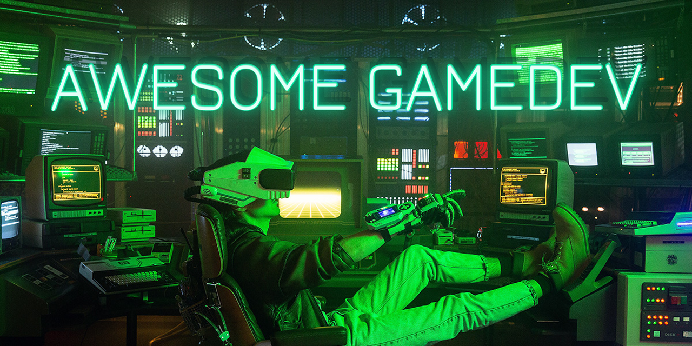

	
	  
	
	

A curated collection of resources to game development (art, design, code, marketing, tutorials, ...). To add, remove or change things on the list, please create a pull request.

Maintained by [Fronkon Games](https://github.com/FronkonGames).

## Contents

- [Contents](#contents)
- [**Art**](#art)
- [**Design**](#design)
- [**Code**](#code)
- [**Audio**](#audio)
- [**Organization**](#organization)
- [**Unity**](#unity)
- [**Unreal**](#unreal)
- [**Engines**](#engines)
- [**Postmortems**](#postmortems)
- [**Web**](#web)
- [**Resources**](#resources)
- [**Tools**](#tools)
- [**Social**](#social)
- [**Marketing**](#marketing)
- [**Commercial**](#commercial)
- [**Localization**](#localization)
- [**Bureaucracy**](#bureaucracy)
- [**Hardware**](#hardware)
- [**Testing**](#testing)
- [**Misc**](#misc)
- [**Fun**](#fun)

## **Art**

* Lots of icons from iOS apps ([link](https://iosicongallery.com/)).
* A gallery of interesting visual styles used in games ([link](http://videogameartstyles.tumblr.com/)).
* Futuristic interfaces from movies and videogames ([link](http://futureinterface.tumblr.com/)).
* Videogames logos ([link](http://gamelogos.tumblr.com/)).
* Blender to Unity workflow ([link](http://zakjr.com/blog/blender-to-unity-workflow-part-1/)).
* No bullshit pixel art tutorial ([link](http://pixelartus.com/post/85312310886/retronator-no-bullshit-pixel-art-tutorial)).
* How to Pixel Art ([youtube](https://www.youtube.com/playlist?list=PLG0tvJ_jRDIVqRSjelh_uyuZpREN-T4ZF)).
* 60 of the finest tutorials and resources about Pixel Art ([link](https://www.reddit.com/r/gamedev/comments/2hdsdi/everything_you_need_to_know_about_pixel_art_60_of)).
* Draw a cartoon monster character in Photoshop ([link](http://design.tutsplus.com/tutorials/draw-a-cartoon-monster-character-in-photoshop--psd-18136)).
* How to do Pixel Art ([youtube](https://www.youtube.com/playlist?list=PLAdAph7mbAcZF43uD0YRlo8lpF3L61Aal)).
* Understanding color ([youtube](https://www.youtube.com/watch?v=Qj1FK8n7WgY)).
* PBR texture conversion ([link](http://www.marmoset.co/toolbag/learn/pbr-conversion)).
* Making textureless 3D work, a how-to/making of guide ([link](http://www.gamasutra.com/blogs/TomasSala/20140206/210238/Making_textureless_3D_work_a_howtomaking_of_guide.php)).
* How to make pixel art metallic platform tiles in Photoshop ([youtube](https://www.youtube.com/watch?v=vK4pLJZfo_E)).
* The Animation Process of Ori ([link](http://www.gdcvault.com/play/1021791/Animation-Bootcamp-The-Animation-Process)).
* Color in games: An in-depth look at one of game design's most useful tools ([link](http://www.gamasutra.com/blogs/HermanTulleken/20150729/249761/Color_in_Games.php)).
* Intro To Blender for Absolute Beginners ([youtube](https://www.youtube.com/watch?v=2pGGDxVF-pk)).
* Physically based rendering ([link](http://blog.wolfire.com/2015/10/Physically-based-rendering)).
* Blender game character creation series ([youtube](https://www.youtube.com/playlist?list=PLyelx0TsmSpeHKYfP-_HG37deH3RW5sMD)).
* How to learn Blender 3D in under 24 hours ([link](http://www.creativebloq.com/blender/learn-blender-3d-under-24-hours-111518089)).
* Blender Tutorial from the very basics ([youtube](https://www.youtube.com/watch?v=A3HOEjmLMbQ)).
* Spriting guide ([link](http://www.dragonflycave.com/recoloring.aspx)).
* Pixel Art tutorial series ([youtube](https://www.youtube.com/playlist?list=PLC6BCB8E64F315574)).
* Blender low poly Pokemon tutorial ([youtube](https://youtu.be/HH4Y9ghqRr4)).
* Weapon modeling tutorials ([link](https://gumroad.com/timb)).
* Creating perfectly pixelated games with Unity (2D or 3D) ([link](http://www.gamasutra.com/blogs/AhmetKamilKeles/20160421/271027/Creating_perfectly_pixelated_games_with_Unity_2D_or_3D.php)).
* An introduction to spine a 2D bone based animation system ([link](http://www.gamefromscratch.com/post/2016/04/25/An-Introduction-To-Spine-A-2D-Bone-Based-Animation-System.aspx)).
* Making the world of Firewatch ([link](http://www.gdcvault.com/play/1023191/Making-the-World-of)).
* HD index painting in photoshop ([link](http://danfessler.com/blog/hd-index-painting-in-photoshop)).
* Photoshop as game editor ([link](http://www.gamasutra.com/blogs/JochenHeizmann/20160506/272131/Photoshop_as_game_editor.php)).
* Game art tricks ([link](https://simonschreibt.de/game-art-tricks/)).
* How to build sci-fi environments in Unity 5 ([link](http://www.3dartistonline.com/news/2016/05/how-to-build-sci-fi-environments-in-unity-5/)).
* Technical study: Overwatc ([link](http://polycount.com/discussion/170394/technical-study-overwatch-image-heavy)).
* The brilliance in Mad Max's world design ([link](https://shaabanm.wordpress.com/2015/09/23/the-brilliance-in-mad-maxs-world-design/)).
* Making of The Descendant ([link](https://madewith.unity.com/stories/making-descendant)).
* 10 mobile games with the best map screens ([link](https://www.linkedin.com/pulse/10-mobile-games-best-map-screens-junxue-li)).
* Photoscan tutorial - Photogrammetry ([youtube](https://www.youtube.com/watch?v=bero-JBTAX8)).
* Gamma and Linear space - What they are and how they differ ([link](http://www.kinematicsoup.com/news/2016/6/15/gamma-and-linear-space-what-they-are-how-they-differ)).
* How to avoid bad color schemes ([link](https://neutroniogames.blogspot.com.es/2016/06/color-theory-for-programmers_18.html)).
* Creating our Logo ([link](https://i.imgur.com/zbSbj47.png)).
* Texturing for beginners: Top 14 Ways to mix textures and shaders, in Blender ([youtube](https://www.youtube.com/watch?v=liNGmdXsfbs)).
* Lighting for game developers ([youtube](https://www.youtube.com/watch?v=O9XPEMu4Chs)).
* Creating high-quality character art ([link](http://80.lv/articles/alessando-baldasseroni-creating-high-quality-character-art/)).
* Space Marine sprite ([youtube](https://www.youtube.com/watch?v=9EKm3FBcEL4)).
* Playdead's Inside and minimalism ([youtube](https://www.youtube.com/watch?v=F0egRN-49h0)).
* Unity VFX tutorials ([youtube](https://www.youtube.com/watch?v=M-ADfgaQvCU)).
* Pixels and voxels, the long answer ([link](https://medium.com/retronator-magazine/pixels-and-voxels-the-long-answer-5889ecc18190)).
* Strategy game battle UI ([link](https://medium.com/@treeform/strategy-game-battle-ui-3b313ffd3769)).
* The remastering of textures in Bioshock The Collection ([link](https://80.lv/articles/the-remastering-of-textures-in-bioshock-the-collection/)).
* The psychology of UI design: The gutenberg diagram & modern UI ([youtube](https://www.youtube.com/watch?v=Saqz6uRlKyA)).
* Multiplatform 3D art development for indies ([youtube](https://www.youtube.com/watch?v=IZNHQf84I8M)).
* Environment design: Style over function ([link](https://80.lv/articles/environment-design-style-over-function/)).
* Blender - Low Poly Scenario ([youtube](https://www.youtube.com/watch?v=yrXrRLs1vec&list=PLpPd_BKEUoYi1ha6w28SUq7iYa1NC719E)).
* Stylized normal mapping ([link](http://www.alkemi-games.com/a-game-of-tricks-iv-stylized-normal-mapping/)).
* Color combinations from designers ([link](http://colorsupplyyy.com/app/)).
* 6 examples of UI design that every game developer should study ([link](http://www.gamasutra.com/view/news/289637/6_examples_of_UI_design_that_every_game_developer_should_study.php)).
* Learn how to prototype levels in Blender ([youtube](https://www.youtube.com/watch?v=2Y2WwvOwn4w)).
* An introduction to procedural animations ([link](http://www.alanzucconi.com/2017/04/17/procedural-animations/)).
* Animation in games: function and automation ([link](https://80.lv/articles/animation-in-games-function-and-automation/)).
* Low poly modeling: style through economy ([youtube](https://youtu.be/H1oNuKChsdU)).
* Lights, lights and Tube Lights ([link](https://madewith.unity.com/en/stories/tube-lights-in-antigraviator)).
* Creating a kraken in Inkscape & Krita ([link](http://www.2dgameartguru.com/2017/06/creating-kraken-in-inkscape-krita.html)).
* Stylized VFX in Rime ([youtube](https://youtu.be/lAYIF0lwy60)).
* Creating the striking pixel art of Crawl ([link](http://www.gamasutra.com/view/news/300004/Game_Design_Deep_Dive_Creating_the_striking_pixel_art_of_Crawl.php)).
* Creation facial 2D animation for games ([link](https://80.lv/articles/creation-facial-2d-animation-for-games/)).
* Simple stylized content for Unity games ([link](https://80.lv/articles/simple-stylized-content-for-unity-games/)).
* Create a forest in UE4 in one hour ([youtube](https://www.youtube.com/watch?v=FzoY062kY1s)).
* Creating pixel art in Blender ([link](http://www.javin-inc.com/blenderpixel/)).
* 25 official beginner Blender tutorial videos. ([youtube](https://www.youtube.com/playlist?list=PLa1F2ddGya_8V90Kd5eC5PeBjySbXWGK1)).
* Optical effects in User Interfaces (for true nerds) ([link](https://medium.muz.li/optical-effects-9fca82b4cd9a)).
* Cyberpunk scene production with Unity & Blender ([link](https://80.lv/articles/cyberpunk-scene-production-with-unity-blender/)).
* The best pixel art tools for making your own game ([link](http://www.pcgamer.com/best-pixel-art-maker-tools/)).
* Real time rendering, an overview for artists ([link](https://jesshiderue4.wordpress.com/real-time-rendering-an-overview-for-artists/)).
* How to model and texture architectural scenes ([link](https://80.lv/articles/how-to-model-and-texture-architectural-scenes/)).
* Stylized prop production with Substance Painter ([link](https://academy.allegorithmic.com/courses/c203935e374ca25287b00df0f6775262)).
* A database of palettes for pixel art ([link](https://lospec.com/palette-list)).
* Realistic vs. Stylized asset production: a technique overview ([link](https://80.lv/articles/realistic-vs-stylized-technique-overview/)).
* An interesting analysis on the art style of Overwatch ([link](https://80.lv/articles/overwatch-technical-overview/)).
* A step-by-step guide to modeling in Unreal Engine ([link](https://game-ace.com/blog/unreal-engine-3d-modeling-a-step-by-step-guide)).
* GPU performance for game artists ([link](http://www.fragmentbuffer.com/gpu-performance-for-game-artists/)).
* Stylized environment production in Unity ([link](https://80.lv/articles/stylized-environment-production-in-unity/)).
* VFX staples: shape, color, and motion ([link](https://80.lv/articles/vfx-staples-shape-color-and-motion/)).
* Blender to Godot 3, low poly scene import ([youtube](https://youtu.be/SiueBTuwS_4)).
* How to use Spine and make awesomes 2D animations ([youtube](https://youtu.be/pyKDC-ptFIg)).
* Creating simple pixel art textures ([link](http://www.slynyrd.com/blog/2018/2/15/pixelblog-2-texture)).
* Killer sci-Fi environment production tips and tricks ([link](https://80.lv/articles/killer-sci-fi-environment-production-tips-and-tricks/)).
* Photogrammetry guide for 3D artists ([link](https://80.lv/articles/full-photogrammetry-guide-for-3d-artists/)).
* Building great lighting in Unity ([link](https://80.lv/articles/building-great-lighting-in-unity/)).
* Math for game programmers: Juicing your cameras with math ([youtube](https://youtu.be/tu-Qe66AvtY)).
* Stylized character production techniques in Unreal Engine ([link](https://80.lv/articles/stylized-character-production-techniques-in-ue4/)).
* Realistic material design tips and tricks ([link](https://80.lv/articles/realistic-material-design-tips-and-tricks/)).
* Building the Just Cause 3 animation and rigging pipeline ([youtube](https://youtu.be/Tfw21ciEyZE)).
* Dirt generator in Substance Designer ([link](https://80.lv/articles/dirt-generator-in-substance-designer/)).
* Stylizing 3D character content: model, texture and details ([link](https://80.lv/articles/stylizing-3d-character-content-model-texture-details/)).
* Creating Riot-like stylized VFX in Unity, tips and tricks ([link](https://80.lv/articles/creating-stylized-vfx-in-unity/)).
* Tips on creating stylized 3D content ([link](https://80.lv/articles/tips-on-creating-stylized-3d-content/)).
* Making Zelda-like VFX with Unity ([link](https://80.lv/articles/making-zelda-like-vfx-with-unity/)).
* Seamless forest textures with photogrammetry ([link](https://80.lv/articles/creating-a-forest-biome-with-photogrammetry/)).
* Making Wild West scene with CryEngine ([link](https://80.lv/articles/making-wild-west-scene-with-cryengine/)).
* Apocalyptic environment in Blender ([youtube](https://youtu.be/mVaxO05toJg)).
* Game UX style guide: Why do you need one? ([link](https://www.gamasutra.com/blogs/OmTandon/20180830/325522/Game_UX_Style_Guide_Why_do_you_need_one.php)).
* Color palettes, a guide ([link](https://www.gamedev.net/articles/visual-arts/color-palettes-r4964/)).
* Tips on low poly indie game creation ([link](https://80.lv/articles/omno/)).
* Stylized 3D game asset tutorial: Low poly with Blender 2.8 ([youtube](https://www.youtube.com/watch?v=zpP9_i9TpbY)).
* The best design tools for everything ([link](https://github.com/LisaDziuba/Awesome-Design-Tools)).
* Low poly character design ([link](https://sundaysundae.co/how-to-make-low-poly-characters/)).
* Hand-Painted texture guide ([link](https://80.lv/articles/001agt-hand-painted-texture-guide-from-vsquad/)).
* Best practice for particle effects in 2D pixel art games ([link](https://imgur.com/gallery/z4Boura)).
* How to create a character with ZBrush ([youtube](https://youtu.be/VIFJWi4u6Ls)).
* Typography in games ([youtube](https://youtu.be/iEonPcoqEFQ)).
* Improve your programmer art: Up your color game ([youtube](https://youtu.be/aT_gghruWAg)).
* High to low Poly workflow: Blender to Substance Painter to Unity ([youtube](https://youtu.be/rfBp9YhkoWo)).
* How a Blizzard artist approaches stylized character creation ([link](https://stylizedstation.com/article/how-a-blizzard-artist-approaches-stylized-character-creation/])).
* Sci-Fi level builder in Houdini ([link](https://www.sidefx.com/tutorials/sci-fi-level-builder/)).
* Free Blender beginner course ([youtube](https://www.youtube.com/playlist?list=PLR3Ra9cf8aV23C2oBB3aFLla6ABAPYiDk)).
* How to make 1-bit pixel art ([youtube](https://youtu.be/0BZwEoj50uw)).
* An interview with Robert Hodri, senior 3D artist at id Software ([link](https://www.dgedwards.com/2020/04/08/robert-hodri-senior-3d-artist-id-software/)).
* Creating your own stylized environments for beginners ([youtube](https://youtu.be/F1eyzCDvV7Y)).
* Hand painted, Blizzard-style character tutorial ([youtube](https://youtu.be/HwZ9Sj03cBQ)).
* Gears Hammer of Dawn ([link](https://lexdev.net/tutorials/case_studies/gears_hammerofdawn.html)).
* Sphere break tutorial using Houdini and Unreal engine ([youtube](https://youtu.be/dVgKpOYo-4Q)).
* Full 3D game asset workflow explained (I/V) ([youtube](https://youtu.be/yC-r-P_0Ze0)).
* 5 great game art styles for BAD artists ([youtube](https://youtu.be/7v4EcanyRws)).
* Stylized beach environment in Blender & Substance ([youtube](https://youtu.be/kxw559A6XFk)).
* How to make 3D stylized weapons ([youtube](https://youtu.be/G4xTKnBsWro)).
* 3D character from sketch to game ([youtube](https://youtu.be/ogz-3r0EHKM)).
* How to create your own real time sci-fi environment in UE4 ([youtube](https://youtu.be/Zj3edYYaOCo)).
* How to easily create hand painted models in Blender & Substance Painter ([youtube](https://youtu.be/vEkstWB2H_Q)).
* Making simple stylized 3D models with Blender, ZBrush & Substance Painter ([youtube](https://youtu.be/Zn9rUQ2BCBs)).
* The Diablo 3 VFX shader with Unity ([youtube](https://youtu.be/jh7DtNXqnlM)).
* Typography in games ([youtube](https://www.youtube.com/watch?v=iEonPcoqEFQ)).
* Easy material generation, a quick look at Materialize ([youtube](https://www.youtube.com/watch?v=hjIUdOvkW2Y)).
* The ultimate guide for creating stylized hair in ZBrush ([youtube](https://www.youtube.com/watch?v=VJ2nMJRtIwQ)).
* Directed procedural workflow in Houdini and Unity ([link](https://80.lv/articles/houdini-engine-directed-procedural-workflow-in-houdini-and-unity/)).
* How to create stylized 3D character models in Blender, ZBrush and Substance ([youtube](https://youtu.be/jUH3Ms_7Heg)).
* Blender 2.9 PBR texturing beginner tutorial ([youtube](https://www.youtube.com/watch?v=A7QteBvUOdQ)).
* Creating beautiful sci-fi worlds in Unreal Engine 4, full breakdown ([youtube](https://www.youtube.com/watch?v=q4nAIo1VAAQ)).
* Houdini Engine installation guide for Unity ([youtube](https://youtu.be/_Wte3iJYGNM)).
* Making procedural pixel textures ([link](https://3drealms.com/devblog/graven-dev-blog-4-making-procedural-pixel-textures/)).
* How to become an environment artist for games ([youtube](https://www.youtube.com/watch?v=uPtJMke4LRE)).
* 7 Unity tips for a beginner 3D artist ([link](https://anananasstudio.medium.com/7-unity-tips-for-a-beginner-3d-artist-fdd3486c1140)).
* How games use light to manipulate you ([youtube](https://www.youtube.com/watch?v=7MNl-j7WqTw)).
* Realtime environment lighting with Unity HDRP ([link](https://medium.com/elegos-development-blog/realtime-environment-lighting-with-unity-hdrp-7d04846844e8)).
* From start to finish: bringing characters to life ([link](https://medium.com/@sigono/from-start-to-finish-bringing-characters-to-life-in-opus-echo-of-starsong-1d9d8a7b256b)).
* UX designer role in a gamedev project ([link](https://medium.com/@ilyakanatov/ux-designer-role-in-a-gamedev-project-2022-7c42950b8b20)).
* Growing as a VFX artist ([youtube](https://www.youtube.com/watch?v=j9PVr8YKp_E)).
* A compilation of futuristic UI from movies and TV series ([link](https://www.hudsandguis.com/)).
* The Hollow Knight look in 15 mins ([youtube](https://www.youtube.com/watch?v=ke0k2o9-yJo)).
* Game User Interface: how to develop a Visual Style ([link](https://medium.com/@alenaeres/game-user-interface-how-to-develop-a-visual-style-fab5cb7a70dd)).
* Creating Pixel Art ([link](https://pixeljoint.com/forum/forum_posts.asp?TID=11299)).
* Common mistakes in Pixel Art ([link](https://derekyu.com/makegames/pixelart2.html)).
* Blender to Unity: How to get the Right Rotation, Scale and Animations ([youtube](https://www.youtube.com/watch?v=Ojh3aE53j-c)).
* Stylized Skyrim style dungeon environment tutorial ([youtube](https://www.youtube.com/watch?v=86JrNHAhtHg)).
* Photogrammetry guide ([link](https://github.com/mikeroyal/Photogrammetry-Guide)).
* A database of PBR values for real-world materials ([link](https://github.com/AntonPalmqvist/physically-based-api)).
* Another database of PBR values for CG artists ([link](https://physicallybased.info/)).
* Blender facial animation ([youtube](https://youtu.be/SW0J0bEa6x4)).
* Seamless textures for Unity with Midjourney ([youtube](https://www.youtube.com/watch?v=_4dwLbqp-e4)).
* How to make your game stand out visually, from a 3D artist at Blizzard ([youtube](https://www.youtube.com/watch?v=TL_8k1nkuD8)).
* A generator of accessible color combinations, in pairs ([link](https://randoma11y.com/)).
* Using AI to generate game art ([youtube](https://www.youtube.com/watch?v=UZEvwJCoWho)).
* How to use shaders to create stylized VFX ([youtube](https://www.youtube.com/watch?v=pqdVG_qcKok)).
* Official Lightmapping troubleshooting guide ([forum](https://forum.unity.com/threads/lightmapping-troubleshooting-guide.1340936/)).
* Game UI Database: collecting references to inspire designers ([link](https://www.gameuidatabase.com/)).
* How to find a UI theme for your game ([link](https://medium.com/mighty-bear-games/how-to-find-a-ui-theme-for-your-game-3dc7ce3599fb)).
* Introduction to Art Direction for Games ([link](https://shahriyarshahrabi.medium.com/introduction-to-art-direction-for-games-c43fe0162cf6)).
* Cinematic lighting in Unity, from creation to final render ([youtube](https://www.youtube.com/watch?v=I1i8uDG-MYo)).
* Visual design rules you can safely follow every time ([link](https://anthonyhobday.com/sideprojects/saferules/)).
* Introduction to Art Direction for Games ([link](https://shahriyarshahrabi.medium.com/introduction-to-art-direction-for-games-c43fe0162cf6)).
* How to make a game cinematic ([link](https://medium.com/my-games-company/how-we-made-a-game-cinematic-our-wins-and-mistakes-with-rush-royale-7097b052ef52)).
* Visual design rules you can safely follow every time ([link](https://anthonyhobday.com/sideprojects/saferules/)).
* Massive database of game UIs ([link](https://www.gameuidatabase.com/)).
* Introduction to Art Direction for Games ([link](https://shahriyarshahrabi.medium.com/introduction-to-art-direction-for-games-c43fe0162cf6)).
* The material art of The Last Of Us Part I ([youtube](https://www.youtube.com/watch?v=DEuYcOWNV2k)).
* 7 tips for Animation beginners ([link](https://80.lv/articles/7-tips-for-animation-beginners/)).

**[⬆ back to top ⬆](#Contents)**
 

## **Design**

* Rules to developing addictive mobile games ([link](http://visual.ly/rules-developing-addictive-mobile-games)).
* User Interface (UX) techniques ([youtube](https://www.youtube.com/watch?v=7OSkB4BCx00)).
* The basic fundamentals of Competitive Melee ([youtube](https://www.youtube.com/watch?v=pQxy26IijUA)).
* Fingers, Thumbs & People: Designing for the way your users really hold and touch their phones and tablets ([link](http://www.slideshare.net/shoobe01/30min-fingers-touchpeoples)).
* Four ways to design for horror ([link](http://www.gamasutra.com/view/news/217253/Four_ways_to_design_for_horror_from_Amnesia_dev_Frictional_Games.php)).
* Fight or Flight: The neuroscience of Survival Horror ([link](http://www.gamasutra.com/view/feature/172168/fight_or_flight_the_neuroscience_.php)).
* Designing and Integrating Puzzles in Action-Adventure Games ([link](http://www.gamasutra.com/view/feature/131326/designing_and_integrating_puzzles_.php)).
* Designing Monument Valley: Less Game, More Experience ([link](http://www.gdcvault.com/play/1020878/Designing-Monument-Valley-Less-Game)).
* The Pursuit of Games: Designing Happiness ([link](http://www.gamasutra.com/view/feature/3675/the_pursuit_of_games_designing_.php)).
* SCVNGR's Secret Game Mechanics Playdeck ([link](http://techcrunch.com/2010/08/25/scvngr-game-mechanics/)).
* Deconstructor of Fun ([link](http://www.deconstructoroffun.com/)).
* The Applied Value of Player Psychology: Putting Motivational Principles to Work ([link](http://www.gdcvault.com/play/1017784/The-Applied-Value-of-Player)).
* The Chemistry Of Game Design ([link](http://www.gamasutra.com/view/feature/129948/the_chemistry_of_game_design.php)).
* Psychology, Human Evolution and Game Design ([youtube](https://www.youtube.com/watch?v=b7SjEDLCsco)).
* How to Write a Horror Story ([link](http://www.wikihow.com/Write-a-Horror-Story)).
* The guide to open world environment design ([link](http://80.lv/articles/skyrim-designer-on-building-virtual-worlds/)).
* How (and why) to write a great Game Design Document ([link](http://www.gamesandlearning.org/2015/10/08/how-and-why-to-write-a-great-game-design-document/)).
* The 7 Hidden Patterns of Successful Storyboards ([youtube](https://www.youtube.com/watch?v=pmpmkV5b5qM)).
* Game UI design ([link](http://gamasutra.com/blogs/BrianOppenlander/20151223/262574/Game_UI_design.php)).
* Geometric progression ([youtube](https://www.youtube.com/watch?v=EzeyDFWYpIM)).
* 25 Best UX Design Tutorials ([link](http://1stwebdesigner.com/best-ux-design-tutorials/)).
* The eight steps game design document ([link](https://es.scribd.com/doc/299827462/8-Step-Game-Design-Document)).
* About Combat System Design ([link](http://breadcrumbsinteractive.com/about-combat-system-design/)).
* UX How-To ([youtube](https://www.youtube.com/playlist?list=PLg-UKERBljNy2Yem3RJkYL1V70dpzkysC)).
* 5 approaches to Crafting Systems in games ([link](http://gamedevelopment.tutsplus.com/articles/5-approaches-to-crafting-systems-in-games-and-where-to-use-them--cms-22628)).
* Designing game narrative: How to create a great story ([link](http://www.develop-online.net/opinions/designing-game-narrative-how-to-create-a-great-story/0185460)).
* On making good combat mechanics ([link](http://joesopko.weebly.com/blog/on-making-good-combat-mechanics-part-1)).
* Extra Credits: game design channel ([youtube](https://www.youtube.com/playlist?list=PLtkJ7uLv7p0JMUNBbtMfh3wrkHKnWeyxd)).
* How rhythm engages players ([youtube](https://www.youtube.com/watch?v=1z1r5RZFoS0)).
* On making good combat mechanics ([link](http://www.gamasutra.com/blogs/JosephSopko/20160630/276193/On_Making_Good_Combat_Mechanics_Part_1.php)).
* Platformer controls: how to avoid limpness and rigidity feelings ([link](http://www.gamasutra.com/blogs/YoannPignole/20140103/207987/Platformer_controls_how_to_avoid_limpness_and_rigidity_feelings.php)).
* Death in video games ([youtube](https://www.youtube.com/watch?v=4D6hJG3GVF0)).
* Why The Witcher 3's Sidequests Are So Good ([youtube](https://www.youtube.com/watch?v=fkA3KKSHx9o)).
* 6 books every game and product designer should read ([link](http://www.doriadar.com/6-books-every-game-product-designer-read/)).
* A collection of mobile game screenshots ([link](http://gamesinspiration.com/)).
* Why do FPS boss battles suck? ([youtube](https://www.youtube.com/watch?v=pAI3klmQCno)).
* A Theory of Fun 10 years later ([link](http://www.gdcvault.com/play/1016632/A-Theory-of-Fun-10)).
* Why is Pokemon Go so addicting? ([youtube](https://www.youtube.com/watch?v=1dQ5O95Zy7Y)).
* Making difficult fun: How to challenge your players ([link](http://gamedevelopment.tutsplus.com/tutorials/making-difficult-fun-how-to-challenge-your-players--cms-25873)).
* Diablo: A classic game postmortem ([youtube](https://www.youtube.com/watch?v=VscdPA6sUkc)).
* How games do health ([youtube](https://youtu.be/4AEKbBF3URE)).
* How Hyper Light drifter’s ammo recharges its combat ([link](https://www.rockpapershotgun.com/2016/07/29/how-hyper-light-drifters-ammo-recharges-its-combat/)).
* The language of Video Games ([youtube](https://www.youtube.com/watch?v=qsSpo8DPuIc)).
* Composition techniques and player direction ([link](https://shapeofplay.wordpress.com/2013/06/25/composition-level-design/)).
* How Pillars of Eternity changed the stats game ([youtube](https://www.youtube.com/watch?v=9xP4U2z3d-Y)).
* A taxonomy of randomness in Hearthstone ([link](http://gangles.ca/2016/09/12/hearthstone-randomness/)).
* 5 things we learned about the appeal of competition from over 239k gamers ([link](http://quanticfoundry.com/2016/08/11/appeal-of-competition/)).
* The rule of Three: Examining plot, Exploration and Combat ([link](http://thegamedesignforum.com/features/reverse_design_ff6_3.html)).
* Roguelike Celebration videos ([youtube](https://www.youtube.com/channel/UCsCqXksJuAkfZRtnW5Pq1mw/videos?shelf_id=0&sort=dd&view=0)).
* User experience design ([link](http://pixeland.io/guides/user-experience-design)).
* Less is More: Designing awesome AI for games ([youtube](https://www.youtube.com/watch?v=1xWg54mdQos)).
* The damage is too damn high or achieving the perfect balance ([link](https://medium.com/@hex3r_/the-damage-is-too-damn-high-or-achieving-the-perfect-balance-3ccccbe70756)).
* The psychology of games ([youtube](https://www.youtube.com/watch?v=K0GZMA6c0T4)).
* System Shock retro analysis ([youtube](https://www.youtube.com/watch?v=oaIAuFtF8XM)).
* World of Warcraft: Level design panel ([youtube](https://www.youtube.com/watch?v=eYDd3T_s1zo)).
* Weaving narratives into procedural worlds ([link](http://www.gamasutra.com/blogs/JoshGe/20161116/285647/Weaving_Narratives_into_Procedural_Worlds.php)).
* MMO economies: hyperinflation, reserve currencies & you! ([youtube](https://www.youtube.com/watch?v=sumZLwFXJqE)).
* The Last Of Us: mechanical analysis  ([youtube](https://youtu.be/hzgSzbMryFY)).
* The Legend of Zelda: The Minish Cap's dungeon design ([youtube](https://www.youtube.com/watch?v=KEVJXqV7XMc)).
* 5 game design innovations from 2016 ([youtube](https://youtu.be/kzfKnI8x5SE)).
* 7 things about primary gaming motivations from over 250000 gamers ([link](http://quanticfoundry.com/2016/12/15/primary-motivations/)).
* How we design games now and why ([link](https://medium.com/@haikus_by_KN/how-we-design-games-now-and-why-bcbc1deb7559)).
* An in-depth analysis/critique of Uncharted 4 ([youtube](https://www.youtube.com/watch?v=F1C3g0HNh34)).
* A game designer explains the counterintuitive secret to fun ([youtube](https://youtu.be/78rPt0RsosQ)).
* The beauty of Permanent Death ([youtube](https://www.youtube.com/watch?v=ye7eEOFCidM)).
* Twilight Princess' dungeon design ([youtube](https://www.youtube.com/watch?v=BTsgWepH3GY)).
* Build a bad guy workshop - Designing enemies for retro games ([link](http://www.gamasutra.com/blogs/GarretBright/20140422/215978/Build_a_Bad_Guy_Workshop__Designing_enemies_for_retro_games.php)).
* Mega Man analysis, Cut Man's level design ([youtube](https://www.youtube.com/watch?v=G4j6f_ukKzo&t=163s)).
* Hyper Light Drifter, visual storytelling done right ([youtube](https://youtu.be/2TLRjV137hw)).
* Sigmoid Functions in game design ([link](http://www.jfurness.uk/sigmoid-functions-in-game-design/)).
* The 12 most helpful youtube channels for game designers ([youtube](http://www.gamedesigning.org/career/helpful-youtube-channels/)).
* The Art of Storytelling ([link](https://www.khanacademy.org/partner-content/pixar/storytelling)).
* 250 game mechanics ([link](http://www.squidi.net/three/by_year.php)).
* 40 game design theses from Master's Degree students ([link](http://www.gamecareerguide.com/theses/)).
* Designing game controls ([link](http://www.gamasutra.com/blogs/AndrewDotsenko/20170329/294676/Designing_Game_Controls.php)).
* Innovation through better design pillars ([link](http://www.gdcvault.com/play/1024176/Finding-Duskers-Innovation-Through-Better)).
* Video game story structure guide ([link](https://medium.com/@calebgeizer/video-game-story-structure-guide-f59a8f8c9b0a)).
* Seven memorable boss fights that every developer should study ([link](http://www.gamasutra.com/view/news/296157/7_memorable_boss_fights_that_every_developer_should_study.php)).
* Early access lessons from Raw Data ([youtube](https://youtu.be/OTgvqfHWMGM)).
* How to get into VR ([link](https://blog.ycombinator.com/how-to-get-into-vr/)).
* Combat system, game mechanics discussion ([youtube](https://www.youtube.com/watch?v=Hk1dHpKnc7A)).
* Storytelling and Character Design series ([youtube](https://www.youtube.com/playlist?list=PL8nFs6m2Yq_X-etltVp94nSxF2on17-ZK)).
* 7 tips for aspiring game designers ([link](http://www.squeakywheel.ph/blog/2017/5/24/7-tips-for-aspiring-game-designers)).
* A psychological approach to making desicions in games ([link](https://sitavriend.wordpress.com/2017/06/19/making-decisions-dual-process-theory/)).
* Core principles to make your environments understandable to the player ([link](https://80.lv/articles/defining-environment-language-for-video-games/)).
* Designing each of the 50 weapons in Dead Cells to feel distinctive ([link](http://www.gamasutra.com/view/news/299848/Designing_each_of_the_50_weapons_in_Dead_Cells_to_feel_distinctive.php)).
* Environment storytelling in Dishonored 2 ([link](https://80.lv/articles/environment-storytelling-in-dishonored-2/)).
* Learn the language of design ([youtube](https://www.youtube.com/watch?v=c06uoVVFZd4)).
* Urban design and the creation of videogame cities ([link](https://medium.com/@KonstantinosD/urban-design-and-the-creation-of-videogame-cities-f56449f74d7f)).
* Pretty pixels, the importance of visuals in game design ([link](http://www.loadingdeveloper.com/pretty-pixels/)).
* Studying the level design of DOOM (2016) ([link](https://www.mapcore.org/articles/development/argent/)).
* What makes a good detective game? ([youtube](https://youtu.be/gwV_mA2cv_0)).
* Book-Length essay on the design of Diablo II ([link](http://thegamedesignforum.com/features/RD_D2_1.html)).
* Game accessibility guidelines ([link](http://gameaccessibilityguidelines.com/)).
* The aesthetic of play ([youtube](https://youtu.be/R7AJwlFHZ70)).
* Final Fantasy Tactics and combat initiative systems ([youtube](https://youtu.be/NtUNI59UzMU)).
* Designing the open world of The Witcher 3 ([youtube](https://youtu.be/oSS5T4od-GQ)).
* Lootboxes and gambling ([youtube](https://youtu.be/YMDGPSWWA18)).
* How games teach us to play their way ([youtube](https://youtu.be/7L8vAGGitr8)).
* The Dos and Don'ts of enemy design ([link](http://www.duelingdevblogs.com/2017/10/the-dos-and-donts-of-enemy-design.html)).
* The design behind Super Mario Odyssey ([youtube](https://youtu.be/z_KVEjhT4wQ)).
* Free-To-Play game design - mechanics, psychology, & business practices ([youtube](https://www.youtube.com/watch?v=2b4XOXS8c2E)).
* The Inner Psycho, morality in games ([link](https://immersionaddict.wordpress.com/2017/11/09/the-inner-psycho-morality-in-games/)).
* An analysis on how Undertale made pacifism fun ([youtube](https://youtu.be/PTgcUIudRY8)).
* Applications of AI in AAA games ([youtube](https://www.youtube.com/playlist?list=PLokhY9fbx05eq8SvcNOxYRquYMzMjF9Ok)).
* Why monster hunter world's combat is so satisfying ([youtube](https://www.youtube.com/watch?v=ZqQtFbOnK0Y)).
* How Celeste teaches you its mechanics ([youtube](https://youtu.be/lZoQ9a7oPvo)).
* Nice advices about level design ([link](https://www.gamasutra.com/view/news/314857/GDC_2018_Level_Design_Workshop_An_expert_roundtable_QA.php)).
* Creating strong video game characters ([youtube](https://youtu.be/4mgK2hL33Vw)).
* What makes a good combat system? ([youtube](https://youtu.be/8X4fx-YncqA)).
* Psych of play: how to make a video game memorable ([youtube](https://youtu.be/SqdqgSZUPes)).
* Prototyping tools for game writers ([link](https://link.springer.com/article/10.1007/s40869-018-0062-y)).
* Intro to narrative design and storytelling ([youtube](https://youtu.be/IGluIMhB73Y)).
* 7 UX lessons from the trenches ([link](https://www.straybasilisk.com/7-game-ux-lessons-from-the-trenches/)).
* How to write a game design document? ([youtube](https://youtu.be/VO4FNf-Xc58)).
* Curates screenshots of games, if you need inspiration for UI/UX ([link](https://gameswat.ch/)).
* Laws of UX ([link](https://lawsofux.com/)).
* How to use ProBuilder for rapid prototyping ([youtube](https://youtu.be/X6ZuBpGzvME)).
* The challenge of cameras ([youtube](https://youtu.be/bHdi5Ar8GXw)).
* Roguelike progression systems ([youtube](https://youtu.be/yOfgUFx9RkU)).
* Level design patterns in 2D games ([link](https://www.gamasutra.com/blogs/AhmedKhalifa/20190610/344344/Level_Design_Patterns_in_2D_Games.php)).
* The power of Cute in video games and the Uncanny Valley ([youtube](https://youtu.be/if_hvgLC5cM)).
* Why does Celeste feel so good to play? ([youtube](https://youtu.be/yorTG9at90g)).
* Designing for color-blindness in games ([youtube](https://youtu.be/KbFs9ghIIEI)).
* Designing a Vertical Slice of your Unity game ([youtube](https://youtu.be/yEP9KWeHwXQ)).
* What I learned after making 100+ game levels ([youtube](https://youtu.be/WPimiBP8d6o)).
* When the fun stops: The science of addiction (GDC 2019) ([youtube](https://youtu.be/vVwu4RDChsY)).
* Game design patterns for building friendships ([youtube](https://youtu.be/voz6S7ryWC0)).
* Five practical game design tools to help design your game ([link](https://www.gamasutra.com/blogs/RafaelVazquez/20200309/359272/5_Practical_game_design_tools_to_help_design_your_game.php)).
* Use the Three Brains Model to design better games ([youtube](https://youtu.be/nM-IcWuNCd4)).
* The game design principle of "Going Tiny", a conversation with Dr David King, developer of "Tiny Islands" ([youtube](https://youtu.be/OXAcWMVzHfE)).
* How design a game from scratch? ([link](https://jasont.co/core-loop/)).
* Check a name for unwanted meanings in foreign languages ([link](http://wordsafety.com/)).
* Tools, books, blogs, tutorials and more for and about narrative design and game writing ([link](https://www.notion.so/f6e4a2e8708948faa21329c9aa275c9f?v=3079661d59c44f7fa9d8d762a6fd2969)).
* The ultimate guide to visual storytelling ([link](https://humanparts.medium.com/the-ultimate-guide-to-visual-storytelling-59e3028fcd8c)).
* Level design on upcoming game Outcasters ([link](https://www.splashdamage.com/news/blocktober-outcasters/)).
* The art of horror game design: Silent Hill 2 and the anatomy of fear ([youtube](https://youtu.be/LMXvLLlIWlY)).
* How games scare you ([youtube](https://www.youtube.com/watch?v=pQ685FM07GE)).
* What "Roguelike" meant ([link](https://zenorogue.medium.com/what-roguelike-meant-fb8b0e1601a)).
* Game Design Document (GDD) template for organizing and pitching your game ([link](https://dvnc.itch.io/5-page-gdd-template)).
* Overview of 600 gameplay design patterns ([link](http://virt10.itu.chalmers.se/index.php/Category:Patterns)).
* The Game UI Database, a comprehensive reference of game interface design ([link](https://www.gameuidatabase.com)).
* Designing a "narrative rogue lite" ([link](https://linusgaertig.itch.io/fireside/devlog/205821/where-we-are-going-the-game-design-of-fireside)).
* Creativity and game design by Chris Crawford ([youtube](https://www.youtube.com/watch?v=dAX0trP3hIQ)).
* A comprehensive list of UX design methods & deliverables ([link](https://uxdesign.cc/a-comprehensive-list-of-ux-design-methods-deliverables-2021-2feb3e70e168)).
* The anatomy of Stardew Valley ([youtube](https://www.youtube.com/watch?v=A_gvgYCE7DY&ab_channel=JM8)).
* Great catalog of game design books ([link](https://www.dexigner.com/directory/cat/Game-Design/Books)).
* Pixar in a Box: the art of storytelling ([link](https://www.khanacademy.org/humanities/hass-storytelling/storytelling-pixar-in-a-box)).
* Analyzing and designing Lock and Key Dungeons ([link](https://www.boristhebrave.com/2021/02/27/lock-and-key-dungeons/)).
* How do you fund that game prototype? ([link](https://gamediscoverability.substack.com/p/how-do-you-fund-that-game-prototype)).
* How to improve In-Game economies ([youtube](https://www.youtube.com/watch?v=L8Ni42Z8i6U)).
* How to become a game designer ([youtube](https://www.youtube.com/watch?v=PMXf0e8n2Oc)).
* The anatomy of a satisfying win ([youtube](https://www.youtube.com/watch?v=9PSY4f0m4m0)).
* Dice-based roguelite mechanics ([link](https://docs.google.com/document/d/1QYQi6fHxDueclA4W8o279Gcz-TDcfMXDYH6oCPy4Wm0)).
* Gamification & psychology mechanics of end level screens ([youtube](https://www.youtube.com/watch?v=RvqT5z9sd24)).
* Accessibility in videogames ([link](https://www.alanzucconi.com/2021/05/24/accessibility-in-videogames/)).
* Better tutorials for complex games ([youtube](https://www.youtube.com/watch?v=-GV814cWiAw)).
* A collection of game design dark patterns ([link](https://www.darkpattern.games/)).
* How to mind your players ([youtube](https://www.youtube.com/watch?v=x-sPHy5PJxI)).
* How to tell stories in video games ([youtube](https://www.youtube.com/watch?v=lvqdHbWzonw)).
* Game economy design essentials: best practices ([link](https://gamasutra.com/blogs/TomHammond/20210812/386698/Game_Economy_Design_Essentials_Part_2_Best_Practices.php)).
* Design by subtraction ([link](https://superjumpmagazine.com/the-definition-of-design-by-subtraction-a051e127f171)).
* How elevates gaming through NFTs ([link](https://medium.com/@InfinitySkies/what-is-digital-ownership-how-infinity-skies-elevates-gaming-through-nfts-4a87e089e3c5)).
* How does a game level work? ([youtube](https://www.youtube.com/watch?v=6dvxETGhssk)).
* Game design concepts for creating different combat systems in RPGs ([link](https://superjumpmagazine.com/the-science-of-battle-systems-in-action-rpgs-4256b1f515b)).
* Practical creativity, what science tells us about creativity ([youtube](https://youtube.com/watch?v=zyVTxGpEO30)).
* Six truths about video game stories ([link](https://bottomfeeder.substack.com/p/six-truths-about-video-game-stories)).
* Common gameplay techniques on 2D platformers ([link](https://medium.com/@andre.appolarif/common-gameplay-techniques-on-2d-platformers-8da3392c3c8f)).
* Deduction mechanics in games ([link](https://medium.com/@inklestudios/elementary-my-dear-watson-dc4a7c7e45af)).
* How to create a memorable video game villain ([youtube](https://www.youtube.com/watch?v=dBtz1S9WRKo)).
* Farlands Design Den, a channel focused on detailed game reviews and breakdown ([youtube](https://www.youtube.com/c/Farlands)).
* This psychological trick makes rewards backfire ([youtube](https://youtu.be/1ypOUn6rThM)).
* Creating video game villains that stand out ([youtube](https://youtu.be/XfRiNr7eSms)).
* Managing multiple tokens for a healthy game economy ([link](https://blog.milliononmars.com/managing-multiple-tokens-for-a-healthy-game-economy-96010907fed7)).
* Game design analysis and principles ([youtube](https://www.youtube.com/watch?v=kmgAFmTSFRs)).
* Tips and Tricks for better level setup in Unity ([youtube](https://youtube.com/watch?v=bZEJ3nZe9J4)).
* Celeste & Forgiveness ([link](https://maddythorson.medium.com/celeste-forgiveness-31e4a40399f1)).
* How video game economies are designed ([youtube](https://www.youtube.com/watch?v=Zrf1cou_yVo)).
* Designing a New Bunker for 'Horizon Forbidden West' ([youtube](https://www.youtube.com/watch?v=KxcXUYx3eLQ)).
* Guide to implementing 2D platformers ([link](http://higherorderfun.com/blog/2012/05/20/the-guide-to-implementing-2d-platformers/)).
* How to create Cinematics using Unity Cinemachine Dolly Track Camera ([youtube](https://www.youtube.com/watch?v=W6-lwxQ1tTg)).
* Building Narrative Games with Yarn Spinner ([youtube](https://www.youtube.com/watch?v=549J0eHE88k)).
* Teaching the AI to walk ([youtube](https://www.youtube.com/watch?v=oOdaUUHRcJI)).
* Storytelling in Open World games, a writer’s guide ([link](https://dreamertalin.medium.com/storytelling-in-open-world-games-e73b0bc1b1b)).
* Approaching a pedagogy of game writing ([youtube](https://www.youtube.com/watch?v=24HHIKOA1ZA)).
* Clean game design principles ([link](https://medium.com/@tricky_fat_cat/clean-game-design-principles-8000ffdd48e1)).
* How to combine video game genres ([youtube](https://www.youtube.com/watch?v=H63Bqex1Urs)).
* Replayability in game design ([link](https://medium.com/super-jump/replayability-in-game-design-798fbb91a726)).
* Narrative deduction mechanics for detective games ([youtube](https://www.youtube.com/watch?v=--3meejDM-U)).
* Risk and reward ([youtube](https://www.youtube.com/watch?v=FXqEykD5Ub4)).
* Paper prototyping 101 ([link](https://www.itsarman.com/paper-prototyping-101/)).
* How to develop a great design concept ([youtube](https://youtu.be/KcE_7bKxlyU)).
* Thread of great game design talks ([twitter](https://twitter.com/moreelen/status/1582401907142070272)).
* Creating a Persona for your Game Design ([link](https://medium.com/@valentinohp11/creating-a-persona-for-your-game-design-ec6a744f1e45)).
* How NOT to build a VR arcade game ([youtube](https://www.youtube.com/watch?v=uj8841GQuyc)).
* Fundamentals of Game Economy ([link](https://medium.com/@specialstrategist0007/fundamentals-of-game-economy-1-7c7fb1f5ddf2)).
* Great books for aspiring Game Designers ([link](https://80.lv/articles/80-level-digest-great-books-for-aspiring-game-designers/)).
* How made a Roguelike game replayable ([youtube](https://www.youtube.com/watch?v=fpS277m2FCs)).
* History of video games (1940's - 2010's) ([link](https://ultimatehistoryvideogames.jimdofree.com/)).
* Advanced math in game design: random walks and Markovian chains in action ([link](https://medium.com/my-games-company/advanced-math-in-game-design-random-walks-and-markovian-chains-in-action-b12d3749d922)).
* Core game loops ([link](https://futuresaltentertainment.medium.com/core-game-loops-what-are-they-and-why-dd5f36ef6157)).
* Creating a Game Design Document (GDD) ([youtube](https://www.youtube.com/watch?v=QepldePhlQA)).
* How to create your own Metroidvania ([link](https://dreamnoid.com/articles/how-to-create-your-own-metroidvania/)).
* The quest to enhance design in video games ([link](https://80.lv/articles/the-quest-to-enhance-design-in-video-games/)).
* Writing the Dialogue System for Cobalt Core ([link](https://medium.com/@daisyowl/writing-the-dialogue-system-for-cobalt-core-34f3c0c03d57)).
* How to get past the "blank canvas" in level design ([youtube](https://www.youtube.com/watch?v=fv8i4IBdAHI)).
* A dialogue pipeline or keeping your lines in line ([link](https://wildwinter.medium.com/a-dialogue-pipeline-db0be8d8509c)).
* Narrative moments on a Budget ([youtube](https://www.youtube.com/watch?v=3pHqSJwPFWQ)).

**[⬆ back to top ⬆](#Contents)**
 

## **Code**

* A list of open source C++ libraries ([link](http://en.cppreference.com/w/cpp/links/libs)).
* Awesome OpenGL ([link](https://github.com/eug/awesome-opengl)).
* Awesome Modern C++ ([link](https://github.com/rigtorp/awesome-modern-cpp)).
* Advanced C++/OpenGL ([youtube](https://www.youtube.com/playlist?list=PLSPw4ASQYyymu3PfG9gxywSPghnSMiOAW)).
* Client side network DO’s and DON’Ts for Game Engine Developers ([link](http://ithare.com/64-network-dos-and-donts-for-game-engine-developers-part-i-client-side/)).
* Scalable game architectures that don't break the bank ([link](http://es.slideshare.net/AmazonWebServices/gam201-scalable-game-architectures-that-dont-break-the-bank-aws-reinvent-2014)).
* Graphics resources ([link](https://github.com/mattdesl/graphics-resources)).
* Basic principles of 3D computer graphics ([youtube](https://www.youtube.com/playlist?list=PL_w_qWAQZtAZhtzPI5pkAtcUVgmzdAP8g)).
* 3D basic lessons ([link](http://www.scratchapixel.com/old/lessons/3d-basic-lessons/)).
* The book of shaders ([link](http://patriciogonzalezvivo.com/2015/thebookofshaders/)).
* Agile software development process: 90 months of evolution ([link](https://www.targetprocess.com/articles/agile-software-development-process-90-months-of-evolution/)).
* Creating a hexagonal grid ([link](http://catlikecoding.com/unity/tutorials/hex-map-1/)).
* Unicode, localization and C++ support ([link](http://www.italiancpp.org/2016/04/20/unicode-localization-and-cpp-support/)).
* Beginning C# with Unity ([youtube](https://www.youtube.com/playlist?list=PLFgjYYTq6xyhtVK6VzLiFe3pmBu-XSNlX)).
* Amit’s game programming bookmarks ([link](http://www-cs-students.stanford.edu/~amitp/gameprog.html)).
* Creating a MapleStory based MMORPG for learning purposes ([link](https://github.com/ZenXChaos/MapleStorySDLCPP)).
* Debugging memory corruption in Unity ([link](http://blogs.unity3d.com/2016/04/25/debugging-memory-corruption-who-the-hell-writes-2-into-my-stack-2/)).
* Implementing a melee combo system in C++ ([link](http://orfeasel.com/implementing-a-melee-combo-system-in-c/)).
* Intro to Unity IA ([youtube](https://www.youtube.com/watch?v=r0kMW3Yasu0)).
* What every programmer needs to know about game networking ([link](http://gafferongames.com/networking-for-game-programmers/what-every-programmer-needs-to-know-about-game-networking/)).
* Introduction to networked physics ([link](http://gafferongames.com/networked-physics/introduction-to-networked-physics/)).
* Multithreading in modern C++ ([link](http://www.modernescpp.com/index.php/multithreading-in-modern-c)).
* Essentials of Software Engineering, with a Game Programming focus ([pdf](http://www.randygaul.net/wp-content/uploads/2016/05/R.Gaul_Essentials_SE.pdf)).
* Remaking Cavestory in C++ ([youtube](https://www.youtube.com/watch?v=ETvApbD5xRo)).
* Three C# garbage examples ([link](https://xenoprimate.wordpress.com/2016/04/08/three-garbage-examples/)).
* Flatbuffers for Unity ([link](http://exiin.com/blog/flatbuffers-for-unity-sample-code/)).
* Data structures in games ([link](http://enemyhideout.com/2016/05/games-101-data-structures-in-games/)).
* C++ for games: Performance, allocations and Data Locality ([link](http://ithare.com/c-for-games-performance-allocations-and-data-locality/)).
* C# binding for Vulkan ([link](https://github.com/Mervill/Tanagra)).
* Upgrading existing C# code to C# 6.0 ([link](http://www.dotnetcurry.com/csharp/1222/upgrade-existing-csharp-code-csharp-6)).
* Rendering multiple lights in Unity ([link](http://catlikecoding.com/unity/tutorials/rendering/part-5/)).
* libyojimbo, a source network library ([link](http://gafferongames.com/2016/07/21/launch-of-libyojimbo/)).
* Raylib, a simple and easy-to-use library to learn videogames programming ([link](http://www.raylib.com/)).
* A collection of Awesome .NET libraries, tools & frameworks ([link](https://dotnet.libhunt.com/)).
* A curated list of awesome C/C++ frameworks, libraries, resources, and shiny things ([link](https://cpp.libhunt.com/)).
* Finite State Machine for game developers ([link](http://gamedevelopertips.com/finite-state-machine-game-developers/)).
* Networking for game programmers ([link](http://gafferongames.com/networking-for-game-programmers/)).
* C# networking ([link](https://16bpp.net/tutorials/csharp-networking/01)).
* Introduction to Computer Graphics and Imaging ([link](https://mdzahidh.github.io/cs148/?class/cs148/)).
* Learn C# by building a simple RPG ([link](http://scottlilly.com/learn-c-by-building-a-simple-rpg-index/)).
* Learn C# online ([link](http://bafflednerd.com/learn-csharp-online/)).
* A collection of awesome .NET libraries, tools, frameworks and software ([link](https://github.com/quozd/awesome-dotnet)).
* Doom 2016, a graphics study ([link](http://www.adriancourreges.com/blog/2016/09/09/doom-2016-graphics-study/)).
* Libgdx multiplatform game development ([link](http://vladimirslav.com/tutorials/)).
* Math for game developers ([youtube](https://www.youtube.com/watch?v=sKCF8A3XGxQ&list=PLW3Zl3wyJwWOpdhYedlD-yCB7WQoHf-My)).
* Game graphics 101: textures, UV mapping, and texture filtering ([link](http://ithare.com/game-graphics-101-textures-uv-mapping-and-texture-filtering/)).
* Modern OpenGL 3.0+ ([youtube](https://www.youtube.com/playlist?list=PLRtjMdoYXLf6zUMDJVRZYV-6g6n62vet8)).
* The math of idle games ([link](http://developers.kongregate.com/blog/the-math-of-idle-games-part-i)).
* Game engine using STD C++ 11 ([youtube](https://www.youtube.com/watch?v=8AjRD6mU96s)).
* A list of popular/awesome videos games, add-ons, maps, etc. hosted on GitHub ([link](https://github.com/leereilly/games)).
* A collection of awesome .NET core libraries, tools, frameworks and software ([link](https://github.com/thangchung/awesome-dotnet-core)).
* A list of modern C++11/14/17 features ([link](https://github.com/AnthonyCalandra/modern-cpp-features)).
* Rapid game prototyping: Tips for programmers ([link](http://devmag.org.za/2014/01/08/rapid-game-prototyping-tips-for-programmers/)).
* The complete guide to Unity and Git ([link](http://www.gamasutra.com/blogs/TimPettersen/20161206/286981/The_complete_guide_to_Unity__Git.php)).
* C++ in Huge AAA Games ([youtube](https://www.youtube.com/watch?v=qYN6eduU06s)).
* List of single-file C/C++ libraries ([link](https://github.com/nothings/single_file_libs)).
* Full list of open source physics engines ([link](http://www.tapirgames.com/blog/open-source-physics-engines)).
* Extensive tutorial resource for learning Modern OpenGL ([link](https://learnopengl.com)).
* Shadow Tactics, a rendering breakdown ([link](https://kosmonautblog.wordpress.com/2017/01/09/shadow-tactics-rendering-breakdown/)).
* How to make Minecraft in C++ and OpenGL ([youtube](https://www.youtube.com/playlist?list=PLMZ_9w2XRxiZq1vfw1lrpCMRDufe2MKV_)).
* Godot game engine tutorial series ([link](http://www.gamefromscratch.com/page/Godot-Game-Engine-tutorial-series.aspx)).
* A library for patching, replacing and decorating .NET and Mono methods during runtime ([link](https://github.com/pardeike/Harmony)).
* Voxel rendering techniques ([link](https://medium.com/@fogleman/voxel-rendering-techniques-fa8d869457ca)).
* Essence of linear algebra ([youtube](https://www.youtube.com/watch?v=kjBOesZCoqc&list=PLZHQObOWTQDPD3MizzM2xVFitgF8hE_ab)).
* Nested coroutines in Unity ([link](http://www.alanzucconi.com/2017/02/15/nested-coroutines-in-unity/)).
* Code design and architecture series ([link](http://codensuch.com/trap-labs-series/part0)).
* Master C++ programming with open source books ([link](https://www.ossblog.org/master-c-programming-with-open-source-books/)).
* 42 recommendations from Intel about coding in C++ ([link](https://software.intel.com/en-us/articles/the-ultimate-question-of-programming-refactoring-and-everything)).
* Unity 5 - Artificial Intelligence / Basic AI ([youtube](https://www.youtube.com/watch?v=p-_QyPu1oLI&index=19&list=PLpPd_BKEUoYi1ha6w28SUq7iYa1NC719E)).
* Writing a game engine in 2017 ([link](http://www.randygaul.net/2017/02/24/writing-a-game-engine-in-2017/)).
* Making A Character Controller in Unity ([youtube](https://www.youtube.com/watch?v=sHMPAO6pU8s&list=PL5KbKbJ6Gf99cmJJjXrkk2fdbWECBiAFb)).
* Data structures and algorithms problems in C++ using STL ([link](http://www.techiedelight.com/data-structures-and-algorithms-interview-questions-stl/)).
* Practical color theory for people who code ([link](https://tallys.github.io/color-theory/)).
* Render pipelines desing in C++ ([link](http://www.marti.works/render-pipelines-desing-in-c/)).
* Anvil, a cross-platform, open-source, MIT-licensed wrapper library for Vulkan ([link](http://gpuopen.com/gaming-product/anvil-vulkan-framework/)).
* Implementing robust AI: Enemy positioning ([link](http://www.rikodu.com/implementing-robust-ai-for-secondhand-enemy-positioning/)).
* A study path for game programmer ([link](https://github.com/miloyip/game-programmer)).
* C++ language quick guide ([link](http://viptechworld.blogspot.com.es/2017/05/cpp-quick-guide-by-vtw.html)).
* Unit Tests, how to write testable code and why it matters ([link](https://www.toptal.com/qa/how-to-write-testable-code-and-why-it-matters)).
* Top 10 algorithms and data structures for competitive programming ([link](http://www.geeksforgeeks.org/top-algorithms-and-data-structures-for-competitive-programming/)).
* Best websites a programmer should visit ([link](https://github.com/sdmg15/Best-websites-a-programmer-should-visit)).
* Program a game engine from scratch ([link](http://dragonfly.wpi.edu/book/)).
* Tinyheaders, one-file C/C++ libraries with no dependencies ([link](https://github.com/RandyGaul/tinyheaders)).
* 7 ways to get better at C++ during this summer ([link](http://www.fluentcpp.com/2017/06/23/7-ways-better-cpp-summer/)).
* A manually curated list of 240+ popular programming podcast episodes ([link](https://docs.google.com/spreadsheets/d/1gIRjeB1Y_AMvtmJsZWl_dNMDJ7lPSIxiVUYyEvrP5P4/htmlview?usp=sharing&sle=true)).
* How to Unit Test Unity code ([youtube](https://youtu.be/TyxDg70hc3g)).
* The Ronimo coding style guide ([link](http://www.gamasutra.com/blogs/JoostVanDongen/20170711/301454/The_Ronimo_coding_style_guide.php)).
* Is your code ready to prevent the Nedelin Catastrophe? ([link](http://www.gamasutra.com/blogs/BartlomiejWaszak/20170719/301973/Is_Your_Code_Ready_to_Prevent_the_Nedelin_Catastrophe.php)).
* The basics of demo programming (2011) ([youtube](https://www.youtube.com/watch?v=TbcZyAO6K7c)).
* Awesome articles on server programming for multiplayer games ([link](http://www.gabrielgambetta.com/client-server-game-architecture.html)).
* Tools, tricks and technologies for reaching stutter Free 60 FPS in Inside ([youtube](https://youtu.be/mQ2KTRn4BMI)).
* Camera logic in a 2D platformer ([link](https://asylumsquare.com/#blog/2017-11-25/Camera-Logic-in-a-2D-Platformer.html)).
* Foliage optimization in Unity ([link](https://www.gamasutra.com/blogs/DannyWeinbaum/20171201/310813/Foliage_Optimization_in_Unity.php)).
* Matrices, from a geometric perspective ([link](http://www.coranac.com/documents/geomatrix/)).
* A framework to translate the rules of a (turn-based) game to a series of simple functions ([link](https://github.com/google/boardgame.io)).
* How to write your own C++ game engine ([link](http://preshing.com/20171218/how-to-write-your-own-cpp-game-engine/)).
* A comprehensive guide to serverless architecture ([link](https://www.simform.com/serverless-architecture-guide/)).
* Game developer’s guide to graphical projections (I/II) ([link](https://medium.com/retronator-magazine/game-developers-guide-to-graphical-projections-with-video-game-examples-part-1-introduction-aa3d051c137d)).
* Using neural networks and machine learning to power up a 2D roguelike in Unity ([link](https://blogs.unity3d.com/es/2017/12/11/using-machine-learning-agents-in-a-real-game-a-beginners-guide/)).
* Profiling, measurement and analysis ([link](https://engineering.riotgames.com/news/profiling-measurement-and-analysis)).
* A rendering abstraction which describes a frame as a directed acyclic graph of render tasks and resources ([link](https://github.com/acdemiralp/fg)).
* The 15 C++11 features you must really use ([link](http://cppdepend.com/blog/?p=319)).
* How to make a game from scratch using Lua and Löve ([link](https://github.com/SSYGEN/blog/issues/30)).
* Books I had to read to develop a game engine ([link](https://www.haroldserrano.com/blog/books-i-used-to-develop-a-game-engine)).
* The poor man's netcode ([link](http://etodd.io/2018/02/20/poor-mans-netcode/)).
* Networked physics in VR ([link](https://developer.oculus.com/blog/networked-physics-in-virtual-reality-networking-a-stack-of-cubes-with-unity-and-physx/)).
* Color theory for programmers, how to find great colors ([youtube](https://youtu.be/-l2g4adWWwo)).
* Shaders: a short story ([link](https://medium.com/@darkdreamday/shaders-a-short-story-31210427a7c)).
* Unreal Engine gameplay framework primer for C++ ([link](http://www.tomlooman.com/ue4-gameplay-framework/)).
* OpenGL, step by step ([link](http://ogldev.atspace.co.uk/)).
* The total beginner's guide to game AI ([link](https://www.gamedev.net/articles/programming/artificial-intelligence/the-total-beginners-guide-to-game-ai-r4942/)).
* A list of useful books for game AI programming ([link](http://alumni.media.mit.edu/~jorkin/aibooks.html)).
* From setup to gameplay, a introduction to C++ for Unreal Engine 4 ([youtube](https://www.youtube.com/watch?v=D4UM73O7Zxs)).
* Game source code collection ([link](https://archive.org/details/gamesourcecode)).
* A list of awesome programming talks by language ([link](https://github.com/hellerve/programming-talks)).
* S.O.L.I.D Design Patterns: Single responsibility principle ([youtube](https://www.youtube.com/watch?v=f5zJ4D2E0dI)).
* Fair play for all pings or lag compensation ([link](https://vercidium.com/blog/lag-compensation/)).
* Dot product, rulers, and bouncing balls ([link](https://www.allenchou.net/2020/01/dot-product-projection-reflection/)).
* Blender for non-artists ([link](https://github.com/jasonswearingen/godot-csharp-tech/tree/dev/docs/articles-tutorials/blender-for-non-artists)).
* Wave Function Collapse tips and tricks ([link](https://www.boristhebrave.com/2020/02/08/wave-function-collapse-tips-and-tricks/)).
* Netcode fundamentals for fast-paced multiplayer games ([youtube](https://youtu.be/6WmK9qa2KIg)).
* One million sprites, more than 120fps ([link](https://coffeebraingames.wordpress.com/2020/04/05/one-million-sprites-more-than-120fps-dots-not-required/)).
* A gentle introduction to AI ([link](https://medium.com/mighty-bear-games/a-gentle-introduction-to-ai-8d7efaea12cc)).
* An Entity Component System with Data Locality in C++ ([link](https://indiegamedev.net/2020/05/19/an-entity-component-system-with-data-locality-in-cpp/)).
* The book of Shaders ([link](https://thebookofshaders.com/)).
* A practical guide for the everyday C++11 programmer ([link](https://stuartwheaton.com/blog/2020-06-14-c++11-guide/)).
* In depth code analysis ([youtube](https://youtu.be/LleJbZ3FOPU)).
* Networking in C++ part #1: MMO Client/Server, ASIO & framework basics ([youtube](https://youtu.be/2hNdkYInj4g])).
* Game Engine Programming 001 ([youtube](https://youtube.com/watch?v=hRL56gXqj-4&list=PLU2nPsAdxKWQYxkmQ3TdbLsyc1l2j25XM)).
* Computer graphics from scratch ([link](https://www.scratchapixel.com/)).
* Weeb's guide to programming in Unity ([link](https://docs.google.com/document/d/1eTRYnxrII3b_vce9EytjGA7PU8HCLVjG8qCyW19kqcA)).
* The definitive FAQ about ECS ([link](https://github.com/SanderMertens/ecs-faq)).
* Multithreading for game engines ([link](https://vkguide.dev/docs/extra-chapter/multithreading/)).
* Blender python addon programming ([youtube](https://www.youtube.com/watch?v=yNdjdmepMMQ)).
* GitHub Pages with snippets for Modern C++ ([link](https://alandefreitas.github.io/moderncpp/)).
* Shaders for game developers (10h) ([youtube](https://youtube.com/playlist?list=PLImQaTpSAdsCnJon-Eir92SZMl7tPBS4Z)).
* Computer graphics resources ([link](https://legends2k.github.io/note/cg_resources/)).
* 3D math primer for graphics and game development ([link](https://gamemath.com/)).
* A curated list of awesome .NET Performance books, courses, blogs, etc ([link](https://github.com/adamsitnik/awesome-dot-net-performance)).
* RPCs, how to make a multiplayer game in Unity 2021.1 ([youtube](https://www.youtube.com/watch?v=6zBsPSww2u4)).
* Game shaders for beginners ([link](https://github.com/lettier/3d-game-shaders-for-beginners)).
* '3D Math Primer for Graphics and Game Development' (free book) ([link](https://gamemath.com/book/intro.html)).
* Preparing your game for deterministic netcode ([link](https://yal.cc/preparing-your-game-for-deterministic-netcode/)).
* Compute shader 101 ([youtube](https://www.youtube.com/watch?v=DZRn_jNZjbw)).
* Essential math for beginner gamedevs ([youtube](https://www.youtube.com/watch?v=iPWWrM81z-o)).
* Collection of resources related to Signed Distance Field (SDF) ([link](https://github.com/CedricGuillemet/SDF)).
* From brute force to formal elegance, refactoring complicated code ([link](https://medium.com/geekculture/refactoring-complicated-code-ad8b09a5b92b)).
* Developing a Space Arcade game in C++ without an engine ([youtube](https://www.youtube.com/watch?v=v-3TN1dEw4M&list=PL22CMuqloY0qiYlv1Lm_QtfwuFz9OB0NE)).
* Making a game engine in C++ from scratch: designing the architecture ([youtube](https://www.youtube.com/watch?v=sHVEL90NLhc)).
* 5 ways to draw an outline ([link](https://alexanderameye.github.io/notes/rendering-outlines/)).
* Engineering stable and reliable AI ([youtube](https://www.youtube.com/watch?v=OBusUGlnmWI)).
* End-to-End procedural generation in Caves of Qud ([youtube](https://www.youtube.com/watch?v=jV-DZqdKlnE)).
* Smoothstep function in Unreal and Unity ([youtube](https://www.youtube.com/watch?v=dn3y5KVxylQ)).
* Asynchronous programming in C# ([link](https://github.com/davidfowl/AspNetCoreDiagnosticScenarios/blob/master/AsyncGuidance.md)).
* Object-Oriented Entity-Component-System design ([link](https://voxely.net/blog/object-oriented-entity-component-system-design/)).
* Emergent AI, smart agents and events for games ([link](https://psichix.github.io/emergent/)).
* Game engine C++ programming tutorials ([youtube](https://www.youtube.com/watch?v=hRL56gXqj-4&list=PLU2nPsAdxKWQYxkmQ3TdbLsyc1l2j25XM)).
* How to build a platformer AI ([link](https://devlog.levi.dev/2021/09/building-platformer-ai-from-low-level.html)).
* Github's collection of open-source game engines ([link](https://github.com/collections/game-engines)).
* Procedurally generated 3D dungeons ([youtube](https://www.youtube.com/watch?v=rBY2Dzej03A)).
* Create an installer for your game ([link](https://jeannoelseneque.medium.com/create-an-installer-for-your-game-aec453848b13)).
* Introduction to Game Programming (C++) ([youtube](https://www.youtube.com/watch?v=LpEdZbUdDe4&list=PL_xRyXins848jkwC9Coy7B4N5XTOnQZzz)).
* Building a better jump with math ([youtube](https://www.youtube.com/watch?v=hG9SzQxaCm8)).
* Semantic Versioning, a set of rules to standardize software versions ([link](https://medium.com/@ahmetyasinburul/set-of-rules-to-standarize-software-versions-semantic-versioning-b7f71f71851e)).
* You might be thinking about shader performance wrong ([youtube](https://youtube.com/watch?v=7YPPFIqUN84)).
* Introduction to Computer Graphics (26 videos, University of Utah) ([youtube](https://www.youtube.com/playlist?list=PLplnkTzzqsZTfYh4UbhLGpI5kGd5oW_Hh)).
* 'Game Engine Architecture' by Bill Clark ([youtube](https://www.youtube.com/watch?v=mUeNqLcx4eI)).
* The six Design Patterns game devs need ([youtube](https://www.youtube.com/watch?v=hQE8lQk9ikE)).
* Networking of a turn-based game ([link](https://longwelwind.net/blog/networking-turn-based-game/)).
* inja, a template Engine for modern C++ ([link](https://github.com/pantor/inja)).
* Hacking and reverse engineering IL2CPP games with Ghidra ([link](https://noob3xploiter.medium.com/hacking-and-reverse-engineering-il2cpp-games-with-ghidra-5cee894024f2)).
* C# and .NET for beginners ([youtube](https://www.youtube.com/watch?v=xPu_oftSo2I&list=PLm1dtWebLYwWK2zb6lmgdonm3Z5BE5su0)).
* How to become a game engine developer ([link](https://www.haroldserrano.com/blog/how-to-become-a-game-engine-developer)).
* Introduction to GPUs with OpenGL ([link](https://engineering.monstar-lab.com/en/post/2022/03/01/Introduction-To-GPUs-With-OpenGL/)).
* C++ cheat sheets ([link](https://hackingcpp.com/cpp/cheat_sheets.html)).
* Data Flow in game development, or how to avoid spaghetti code ([link](https://medium.com/@zacharybuffone/data-flow-in-game-development-or-how-to-avoid-spaghetti-code-81dc2bf16e98)).
* How to make a game engine in C++ ([youtube](https://www.youtube.com/watch?v=vWU8EltWTfM&list=PLlrATfBNZ98fqE45g3jZA_hLGUrD4bo6_)).
* Create a server for your Unity game using .NET core ([youtube](https://www.youtube.com/watch?v=jLy7A702GhA)).
* Designing a Distributed System for an Online Multiplayer Game ([link](https://theredrad.medium.com/designing-a-distributed-system-for-an-online-multiplayer-game-basics-part-1-17c149245bd2)).
* Game engine architecture ([link](https://isetta.io/blogs/engine-architecture/)).
* A simple guide to .NET memory management ([link](https://medium.com/@andresantarosa/heap-stack-e-garbage-collector-a-practical-guide-to-net-memory-management-system-7e60bbadf199)).
* Asynchronous programming in C# ([link](https://dev.to/kamilbugnokrk/asynchronous-programming-in-c-2jh2)).
* Instant "Game Feel" tutorial: Secrets of Springs ([youtube](https://www.youtube.com/watch?v=bFOAipGJGA0)).
* Design Patterns in C++ ([link](https://refactoring.guru/design-patterns/cpp)).
* Learn C++ programming ([youtube](https://www.youtube.com/watch?v=x40HEj4kHYU&list=PLS9G7A6kaaHM_tqbFAThFH5JZLPpDWIiu)).
* Cheatsheet for the C++ core guidelines ([link](https://github.com/ufoym/cpp-core-guidelines-cheatsheet)).
* Learn C#: 37+ hours in total ([youtube](https://youtube.com/watch?v=_f-CBxcY8Bk&list=PLS9G7A6kaaHNTbz4bsmrhpAvzljf_ZvRg)).
* Building a manageable, headless game server ([link](https://github.com/CubeCoders/AMP/wiki/Building-a-manageable%2C-headless-game-server)).
* How do Video Games Stay in Sync? An intro to the networking of Real Time games ([link](https://medium.com/geekculture/how-do-video-games-stay-in-sync-an-intro-to-the-fascinating-networking-of-real-time-games-e923e66e8a0f)).
* Overview of Global Illumination in Kajiya Renderer ([link](https://github.com/EmbarkStudios/kajiya/blob/main/docs/gi-overview.md)).
* Mafia, a Serverless Multiplayer Game ([link](https://medium.com/@jacksonbowe98/mafia-a-serverless-multiplayer-game-5e15ad64a1fa)).
* GPU Programming for Video Games at Georgia Tech ([youtube](https://www.youtube.com/playlist?list=PLOunECWxELQQwayE8e3WjKPJsTGKknJ8w)).
* Learn OpenGL using C++ ([youtube](https://www.youtube.com/watch?v=b1EZfr3ZM6E&list=PLS9G7A6kaaHNJ3JI-PDoyz8Upq8g1-0LK)).
* The Pyramid of Coding Principles ([link](https://muhammad-rahmatullah.medium.com/the-pyramid-of-basic-coding-principles-e33b7c3cb316)).
* Giving personality to Procedural Animations using Math ([youtube](https://www.youtube.com/watch?v=KPoeNZZ6H4s)).
* How to prevent Cheating and Hacking with proper Client + Server based C# programming ([youtube](https://www.youtube.com/watch?v=MFk6x-r6HEw)).
* Using Wave Function Collapse to create levels ([youtube](https://www.youtube.com/watch?v=TO0Tx3w5abQ)).
* Giving personality to Procedural Animations using Math ([youtube](https://www.youtube.com/watch?v=KPoeNZZ6H4s)).
* C++ 2D game programming using ECS ([youtube](https://youtu.be/S7lXSihz0ac?t=319)).
* Game localization in Unity and Unreal Engine ([link](https://medium.com/@allcorrect/game-localization-in-unity-and-unreal-engine-fbb77b0f40d7)).
* Math for game devs ([youtube](https://youtu.be/fjOdtSu4Lm4?t=254)).
* Real-Time game server internals: Basic theory, architecture, optimization, auto-scaling ([link](https://betterprogramming.pub/real-time-game-server-internals-basic-theory-architecture-optimization-auto-scaling-b2070aa803d9)).
* MMO with Godot and Python ([youtube](https://www.youtube.com/playlist?list=PLA1tuaTAYPbHz8PvTWpFYGag0L6AdYgLH)).
* Intro to C++ for programmers with some experience ([link](https://www.learncpp.com/)).
* Learning modern 3D graphics programming (2012) ([link](https://paroj.github.io/gltut/)).
* The floor is lava, trying to teach C++ ([youtube](https://www.youtube.com/watch?v=PZ9R0e9btH0)).
* Multiplayer, multithreading, and an actor model in C++ ([link](https://david-delassus.medium.com/multiplayer-multithreading-and-an-actor-model-in-c-cda2e950d1d8)).
* Microkernel Architecture in game development ([link](https://medium.com/@johandebruin/microkernel-architecture-in-game-development-64d7ecc2c1d2)).
* Fundamental math for game developers ([link](https://pikuma.com/blog/math-for-game-developers)).
* The Ultimate guide for Physics in Game Development ([youtube](https://www.youtube.com/watch?v=3lBYVSplAuo)).
* Refactoring bloated code in C# ([link](https://code-maze.com/csharp-refactoring-bloated-code/)).
* How to make money as an indie game designer ([link](https://bootcamp.uxdesign.cc/how-to-make-money-as-an-indie-game-designer-full-guide-d3b7361ab5c2)).
* Room generation using Constraint Satisfaction ([link](https://pvigier.github.io/2022/11/05/room-generation-using-constraint-satisfaction.html)).
* C# software developer tool list ([link](https://michaelscodingspot.com/developer-tools/)).
* Everyone can understand transformation matrices and how it works ([youtube](https://www.youtube.com/watch?v=ItGbib1wd0o)).
* Building an infinitely scalable multiplayer game ([link](https://bullet-mania.netlify.app/)).
* A deep dive in to many games GPU frame building ([link](https://www.adriancourreges.com/blog/2020/12/29/graphics-studies-compilation/)).
* Solid principles in C# ([link](https://harshmatharu.com/blog/solid-principles-in-csharp)).

**[⬆ back to top ⬆](#Contents)**
 

## **Audio**

* The basics of recording audio for digital video ([youtube](https://www.youtube.com/watch?v=S9cP1WHL0Zo)).
* Sound effects and scripting in Unity ([youtube](https://www.youtube.com/watch?v=5N-428vKwaE)).
* Game audio tutorials ([youtube](https://www.youtube.com/playlist?list=PLzOBPpKi0Kcvm4tIS6ribeIkIzkv7Bl1Z)).
* Where the sounds from the world's favorite movies are born ([youtube](https://www.youtube.com/watch?v=0GPGfDCZ1EE)).
* DOOM: Behind the music ([youtube](https://www.youtube.com/watch?v=ua-f0ypVbPA)).
* Mario Kart 8 ft. SpaceHamster - Original sound theory ([youtube](https://www.youtube.com/watch?v=mGjVkz-duNc)).
* Designing sound effects ([youtube](https://www.youtube.com/watch?v=AtpMqJ6kOyU)).
* How to make a coin sound effect in Audacity fast & easy ([youtube](https://youtu.be/JVrft9cqduQ)).
* Sound + Music creation software ([link](http://www.pixelprospector.com/sound-music-creation-software/)).
* 8-bit game soundtracks you probably haven't heard ([link](http://imgur.com/gallery/TtAHz)).
* Completely redesigning Pokemon GO sounds ([youtube](https://www.youtube.com/watch?v=11VO_owpOJw)).
* The Last of Us: Music analysis ([youtube](https://youtu.be/7TYNLe8qjMc)).
* The sound of Hearthstone ([youtube](https://www.youtube.com/watch?v=XYKL3uozCfQ)).
* Effective Audio in Game Design ([youtube](https://www.youtube.com/watch?v=g6Z4ad3qBoQ)).
* An introduction to game audio scripting ([link](https://www.asoundeffect.com/game-audio-scripting/)).
* Creating music for games in Fruity Loops 12 ([youtube](https://www.youtube.com/watch?v=sgSZCl0Mdhs)).
* The music of Breath of the Wild ([youtube](https://www.youtube.com/watch?v=3FWVKu1gnWs)).
* Get started making music ([link](https://learningmusic.ableton.com/)).
* Composing the music and sound of Hyper Light Drifter ([youtube](https://youtu.be/k1b9xKRC74E)).
* The sound design secrets of Horizon Zero Dawn ([youtube](https://youtu.be/SIAmi88akl0)).
* How to make commercial-quality orchestral music ([youtube](https://youtu.be/iDaNs3AMWIg)).
* Setting the gold standard for audio in Hellblade ([link](http://www.thesoundarchitect.co.uk/hellblade-senuas-sacrifice-setting-the-gold-standard-for-audio/)).
* The basics of sound design for video games and films ([youtube](https://youtu.be/Zd3507sC7GY)).
* The minimalist sound design of The Witness ([link](https://www.gamasutra.com/view/news/264301/The_minimalist_sound_design_of_The_Witness.php)).
* Musical sound effects in the Super Mario Series ([youtube](https://youtu.be/6hHbTVloizU)).
* How to make indie game music for beginners ([youtube](https://youtu.be/AheuOqlAMvA)).
* Designing sounds for a game ([link](https://www.gamasutra.com/blogs/PavelShylenok/20190506/342095/Designing_Sounds_for_a_Game.php)).
* Creating explosion sounds ([youtube](https://youtu.be/Go7qOzFnOsg)).
* How to make fighting game sounds ([youtube](https://youtu.be/o0epA2d2t_c)).
* Sound design production for open world 3D video game ([youtube](https://youtu.be/iNbLMOmxSO0)).
* Making simple music for your game ([link](https://indiegamedev.net/2020/02/21/making-simple-music-for-your-game/)).
* Making sound effects at home: explosions ([youtube](https://www.youtube.com/watch?v=GKnI7hZMtdI)).
* How to make your own UI sounds ([youtube](https://www.youtube.com/watch?v=mq1kWnOVoAk)).
* Basic music theory for game development ([youtube](https://www.youtube.com/watch?v=B1Pacxs6Pdg)).
* Creating sound effects for a game with only FOSS (Free and open-source) software ([youtube](https://www.youtube.com/watch?v=QGI1QsFcNzU)).
* How to achieve a great game audio in indie games ([link](https://blog.gladiogames.com/all-posts/how-to-achieve-a-great-game-audio-in-indie-games)).
* Sound design complete: great tutorial compilation ([youtube](https://www.youtube.com/watch?v=jWorjBDcty4)).
* How to make sound effects for games ([youtube](https://youtu.be/LgxOcZDor8U)).
* Making music for your indie game ([youtube](https://www.youtube.com/watch?v=U-PllK2C5mw)).
* How to become a videogame music composer? ([link](https://medium.com/donut-lab/how-to-become-a-videogame-music-composer-so-you-are-in-is-the-workflow-there-for-you-e2e7b17867b2)).
* Composing music for video games ([link](https://medium.com/@joffer.winks/composing-music-for-video-games-42d37b26c60a)).
* VR sound design in Unity ([youtube](https://www.youtube.com/watch?v=sCObQSNRqN4)).
* Delivering indie video game voice-over on a budget ([link](https://medium.com/@mattjavanshir/delivering-indie-video-game-voiceover-on-a-budget-6cde64da7499)).
* How to make an Epic Final Boss Fight Theme ([youtube](https://www.youtube.com/watch?v=3zDIfGo0glk)).
* FMOD Harmony tutorial ([youtube](https://www.youtube.com/watch?v=K3UwjWlZjfU)).
* Finding character Voice with Your Voice ([youtube](https://www.youtube.com/watch?v=HUD3BNK-S7Y)).
* Sound Design: Creating powerful weapon sounds from scratch ([youtube](https://www.youtube.com/watch?v=rcOUFK_v0Zg)).
* Interactive music theory cheat sheet ([link](https://muted.io/cheat-sheet/)).
* Choosing the right load type in Unity’s Audio Import Settings ([link](https://medium.com/@made-indrayana/choosing-the-right-load-type-in-unitys-audio-import-settings-1880a61134c7)).
* Creating a Horror Score on a shoestring budget ([youtube](https://www.youtube.com/watch?v=_j12AOrQnqA)).
* A quick, practical primer on crafting memorable game music ([link](https://medium.com/my-games-company/a-quick-practical-primer-on-crafting-memorable-game-music-598d0f1d157b)).
* A project to preserve the old sounds of all types of machines ([link](https://www.conservethesound.de/)).

**[⬆ back to top ⬆](#Contents)**
 

## **Organization**

* Building and managing your team ([youtube](https://www.youtube.com/watch?v=MPZYeVcDkG0)).
* Git centralized workflow ([link](https://www.atlassian.com/git/tutorials/comparing-workflows/centralized-workflow/)).
* How to install GitLab as your private GitHub clone ([link](https://vexxhost.com/resources/tutorials/how-to-install-gitlab-as-your-private-github-clone/)).
* Tools are just means to get the job done ([link](https://medium.com/@VovaNaz/tools-are-just-means-to-get-the-job-done-7f79cc199099)).
* 10 great ways to impress a software engineer on their first day ([link](http://www.sleepeasysoftware.com/10-great-ways-to-impress-a-software-engineer-on-their-first-day/)).
* 85 of the best business tools for startups ([link](http://articles.bplans.com/business-startup-tools-a-curated-list-of-our-favorite-tools-and-resources-to-build-your-company/)).
* Killing the "Lucky Indie" myth: How to build a sustainable microstudio ([youtube](https://www.youtube.com/watch?v=1BCg31KVJok&feature=youtu.be)).
* An App launch guide ([link](https://github.com/adamwulf/app-launch-guide/blob/master/README.md)).
* Developing simple and appealing games ([link](http://www.voidbee.com/blog/develop-simple-and-appealing-games)).
* Project planning for solo gamedev ([link](http://hacknplan.com/project-planning-for-solo-game-developers/)).
* Understanding vertical slicing ([link](http://hacknplan.com/understanding-vertical-slicing)).
* Spiral model for game development ([link](http://gamedevelopertips.com/spiral-model-for-game-development/)).
* How to plan a video game: The pre-production phase ([youtube](https://www.youtube.com/watch?v=_kx_mpRyVMM)).
* The stress of game development - Tips for survival ([youtube](https://youtu.be/XUcp2bNTwBg)).
* How to survive as a solo dev for like a decade or so ([link](http://www.sizefivegames.com/2017/05/04/how-to-survive-as-a-solo-dev-for-like-a-decade-or-so/)).
* How actually make your dream game, publish it and not die in the process ([link](https://godotengine.org/article/how-actually-make-your-dream-game)).
* Detailed guide to Git ([link](https://medium.com/learn-git-today/the-ultimate-git-guide-to-creating-your-first-repo-b50762a6ab00)).
* Choosing Version Control System for development ([link](http://ithare.com/choosing-version-control-system-for-gamedev/)).
* How I got to 200 productive hours a month ([link](https://qotoqot.com/blog/improving-focus/)).
* Techniques for dealing with lack of motivation, malaise, depression ([youtube](https://www.youtube.com/watch?v=i7kh8pNRWOo)).
* A curated directory of resources and tools to help you build your Startup ([link](http://startupstash.com/)).
* Three reasons to soft launch your mobile game ([link](http://www.gamesindustry.biz/articles/2018-01-10-three-reasons-to-soft-launch-your-mobile-game)).
* How to interview game programmers ([youtube](https://youtu.be/a1MjIWGYvy8)).
* Modern approaches to game production ([link](https://80.lv/articles/modern-approaches-to-game-production/)).
* Efficient indie tricks to get close to AAA quality ([youtube](https://youtu.be/15PAsik0PZE)).
* Intensely practical tips for growing an indie studio ([youtube](https://youtu.be/MDYh2mnDCIM)).
* Learn Git in 20 minutes ([youtube](https://youtu.be/IHaTbJPdB-s)).
* Worldbuilding with ProBuilder effective iteration and workflow enhancements ([youtube](https://youtu.be/yJsQJ6gwnn0)).
* Pro tips for managing the unmanageable project ([youtube](https://www.youtube.com/watch?v=dNlEZZlmIcw)).
* Deploying a video game to Steam with GitLab CI ([link](https://medium.com/plapadoo/deploying-to-steam-using-gitlab-2fea0149fdaf)).
* Jenkins for Unity with DigitalOcean ([link](https://github.com/CarlHalstead/Jenkins-for-Unity-with-DigitalOcean/)).
* Advanced entrepreneurship: avoiding total studio disaster ([youtube](https://youtu.be/bIgnwKZj1fA)).
* Easily create isometric diagrams for presentations and documentation ([link](https://isoflow.io)).
* 7 steps of the game development cycle ([youtube](https://www.youtube.com/watch?v=P0g8MgBw0X8)).
* How to choose which game to develop? – A step-by-step guide ([link](https://www.gamedev.net/blogs/entry/2271139-how-to-choose-which-game-to-develop-a-step-by-step-guide/)).
* How to scale game servers using Agones, Node, and Digital Ocean ([link](https://medium.com/rolltableapp/scalable-game-servers-using-agones-node-and-digital-ocean-90e6fb9ee5d)).
* A curated list of resources for CTOs, with the emphasis on startups ([link](https://github.com/kuchin/awesome-cto)).
* Improving large monorepo performance on GitHub ([link](https://github.blog/2021-03-16-improving-large-monorepo-performance-on-github/)).
* How to automate C/C++ game builds using GitHub Actions ([link](https://thatonegamedev.com/cpp/ci-cd-for-c-c-games-using-github-actions/)).
* Going from 0 to successful Kickstarter ([youtube](https://www.youtube.com/watch?v=O-Q_-4Mh8ME)).
* David Wehle about his solo game development experience ([youtube](https://www.youtube.com/watch?v=g5f7yixtQPc)).
* How to find and hire a game dev team ([link](https://gameanalytics.com/blog/developers-assemble-hire-game-dev-team/)).
* Publishing to the Google Play Store ([link](https://andrea-alicino.medium.com/publishing-to-the-google-play-store-23a2a70f5dff)).
* Creating Addressable content builds & Cloud Content Delivery releases in GitHub Actions ([link](https://medium.com/@bencekovacs/creating-addressable-content-builds-cloud-content-delivery-releases-in-github-actions-ef6bd5b972b2)).
* A curated list of awesome things related to GitHub Actions ([link](https://github.com/sdras/awesome-actions)).
* Registering a Developer Account on Google Play and publishing our game ([link](https://stevethedragon.medium.com/registering-a-developer-account-on-google-play-and-publishing-our-game-77861e98f6ad)).
* Lessons learned as a first time game producer so far ([link](https://amebouslabs.medium.com/lessons-learned-as-a-first-time-game-producer-so-far-7a3c7dfb08f3)).
* 7-step guide to game development ([link](https://narsunstudios.medium.com/7-step-guide-to-game-development-fffa6097023c)).
* Real-time production cycle ([link](https://medium.com/@pat.x.guillen/real-time-production-cycle-8d7ee848aa6f)).
* Shader Coding for Beginners 2022 ([link](https://m.twitch.tv/videos/1259390369)).
* Managing people 🤯 ([link](https://klinger.io/posts/managing-people-%F0%9F%A4%AF)).
* Learning to work with branches in Git ([link](https://learngitbranching.js.org/)).
* Studio Design, building a foundation for success and avoiding business disaster ([youtube](https://youtu.be/5ZGE_awGGik)).
* 69 useful tools for game development ([youtube](https://www.youtube.com/watch?v=o6ao9-UIZIQ)).
* How to make games in Unity without an art team ([youtube](https://www.youtube.com/watch?v=M9uNopd28O4)).
* The quirks of creating an indie game with a one man army, and how it’s possible ([link](https://medium.com/@petitlegume/the-quirks-of-creating-an-indie-game-with-a-one-man-army-and-how-its-possible-2eca32f5fd23)).
* Solo Development: myths, reality and survival strategies ([youtube](https://www.youtube.com/watch?v=YaUdstkv1RE)).
* The complexities of Game Development & the importance of Pre-Production ([link](https://medium.com/@TinyColonyGame/the-complexities-of-game-development-the-importance-of-pre-production-9c4008405f25)).
* How to feel engaged at work: a software engineer's guide ([link](https://jasont.co/ennui/)).
* Publishing Unity games on Steam: the Ultimate Guide ([link](https://medium.com/@yoonicode/publishing-unity-games-on-steam-the-ultimate-guide-5e09fc812c65)).
* CI/CD setup with Unity, Plastic SCM, TeamCity: The Implementation ([link](https://medium.com/@soumyaripan/ci-cd-setup-with-unity-plastic-scm-teamcity-the-implementation-part-2-ef3071bfb6f7)).
* Physiological effects of Crunch: a look at the Science ([youtube](https://www.youtube.com/watch?v=Sb2U_9IGgc0)).
* Lessons learned from becoming CTO of a small startup ([link](https://vadimkravcenko.com/en/switching-from-engineering-to-management/)).
* Why Prototyping is important and should come first ([link](https://medium.com/@youngchae.depriest/why-prototyping-is-important-and-should-come-first-game-development-6a724844c094)).
* Why player feedback could be the strongest tool in your arsenal ([link](https://lootlocker.com/blog/why-player-feedback-could-be-the-strongest-tool-in-your-arsenal)).
* Managing a game dev community with GitHub Actions ([link](https://github.blog/2022-07-06-managing-a-game-dev-community/)).
* How to find and engage a great artist: a non-artist primer ([youtube](https://www.youtube.com/watch?v=JDANkhIa7yI)).
* Maintaining studio culture during rapid team growth ([youtube](https://youtube.com/watch?v=IE2siVRMXCw)).
* A self-hosted Git server with CI/CD and Kanban ([link](https://github.com/theonedev/onedev)).
* How to stay focused while working on your startup and having a 9 to 5 ([link](https://fernandopessagno.medium.com/6-ways-to-stay-focused-while-working-on-your-startup-and-having-a-9-to-5-fb0b2d2c8db3)).
* How to stop abandoning game projects ([link](https://www.youtube.com/watch?v=_IXhr2ndEDY)).
* Sharing in Success: how to compensate your team through revenue sharing ([youtube](https://www.youtube.com/watch?v=_l8t2o0X_3k)).
* Why veteran developers say "Make small games and finish them!" ([youtube](https://www.youtube.com/watch?v=-K46mV38qD8)).
* How to scale a game development company ([link](https://medium.com/@lukaszhacura/how-to-scale-a-gamedev-company-9d708a5cbad7)).
* Jenkins detox in production ([link](https://medium.com/outfit7/kicking-the-habit-jenkins-detox-in-production-1e5c4a50b6c8)).
* What is an open salary policy and should you consider having one? ([link](https://www.gamesindustry.biz/what-is-an-open-salary-policy-and-should-you-consider-having-one)).
* Best game project management tools for game developers ([link](https://pinglestudio.com/blog/co-development/best-game-project-management-tools-for-game-developers)).
* An introduction to how game development pipelines work ([link](https://www.gamesindustry.biz/an-introduction-to-how-game-development-pipelines-work)).
* Running a studio Without a huge hit ([youtube](https://www.youtube.com/watch?v=6MWFEo2dHH4)).

**[⬆ back to top ⬆](#Contents)**
 

## **Unity**

* Introduction to Game Development with Unity and C# ([youtube](https://www.youtube.com/channel/UCmtyQOKKmrMVaKuRXz02jbQ)).
* Dynamic lighting on sprites ([link](http://robotloveskitty.tumblr.com/post/33164532086/legend-of-dungeon-dynamic-lighting-on-sprites)).
* Introduction to Unity test tools ([link](http://gamasutra.com/blogs/LiorTal/20140520/218123/Introduction_to_Unity_Test_Tools.php)).
* Memory profiling in Unity ([link](http://www.slideshare.net/williamyang3910/unitekorea2013-memory-profiling-in-unity)).
* C# memory management for Unity developers ([link](http://www.gamasutra.com/blogs/WendelinReich/20131109/203841/C_Memory_Management_for_Unity_Developers_part_1_of_3.php)).
* Mastering Physically Based Shading in Unity 5 ([link](http://www.slideshare.net/RenaldasZioma/unite2014-mastering-physically-based-shading-in-unity-5)).
* 2D best practices in Unity ([youtube](https://www.youtube.com/watch?v=HM17mAmLd7k)).
* Big Android: Best performance on the most devices ([youtube](https://www.youtube.com/watch?v=yFcI6pFEgjk)).
* Managing 2D animation states in Unity ([link](http://johnstejskal.com/wp/creating-2d-animations-from-sprite-sheets-in-unity3d/)).
* Unity youtube channel ([youtube](https://www.youtube.com/user/Unity3D/videos?shelf_id=0&view=0&sort=dd)).
* Serialization best practices ([link](http://forum.unity3d.com/threads/serialization-best-practices-megapost.155352)).
* Best practices for physically based content creation ([youtube](https://www.youtube.com/watch?v=OeEYEUCa4tI)).
* Modern 2D techniques ([youtube](https://www.youtube.com/watch?v=bUGbXThraVM)).
* Unity 3D best practices ([link](https://x-team.com/2014/03/unity-3d-optimisation-and-best-practices-part-1/)).
* Unity 5 - Intro to Lighting and Rendering ([link](http://unity3d.com/es/learn/tutorials/modules/beginner/graphics/lighting-and-rendering)).
* Unity best practices ([link](http://www.glenstevens.ca/unity3d-best-practices/)).
* Infinite terrain generation in Unity ([link](http://code-phi.com/infinite-terrain-generation-in-unity-3d/)).
* EditorWindow lifecycle ([link](http://t-machine.org/index.php/2015/06/25/unity3d-missing-docs-editorwindow-lifecycle/)).
* How to make a MOBA in Unity ([youtube](https://www.youtube.com/playlist?list=PLHW9PxPVcecHLa7JP-Ts09LZYHLIwdky_)).
* Building Unity games in Visual Studio ([link](https://channel9.msdn.com/Events/Visual-Studio/Visual-Studio-2015-Final-Release-Event/Building-Unity-games-in-Visual-Studio)).
* So you want to be a Unity freelancer ([youtube](https://www.youtube.com/watch?v=gVjW-BeS1bk&feature=youtu.be)).
* Character locomotion ([youtube](https://www.youtube.com/watch?v=eVAMOYVSszI)).
* Making of Monument Valley in Unity ([youtube](https://www.youtube.com/watch?v=mCCC9hQm6MM)).
* Quick setup scalable UI in Unity ([youtube](https://www.youtube.com/watch?v=HwZfv_17KN8)).
* Making a sport game in Unity ([youtube](https://www.youtube.com/watch?v=Ud7RNhO_VRU)).
* C# memory and performance tips for Unity ([link](http://www.somasim.com/blog/2015/04/csharp-memory-and-performance-tips-for-unity/)).
* Introduction to Unity Analytics ([youtube](https://www.youtube.com/watch?v=axZJ6R8Iz8c)).
* How to make realistic bullets in Unity ([link](http://www.habrador.com/tutorials/unity-realistic-bullets/)).
* Resources for writing shaders in Unity ([link](https://github.com/VoxelBoy/Resources-for-Writing-Shaders-in-Unity)).
* Art optimizations for Maximum Performance in Unity 5 ([youtube](https://www.youtube.com/watch?v=HsGZ83sQyBI)).
* How we optimized our mobile game ([youtube](https://www.youtube.com/watch?v=G0IdA_CHCUs)).
* The beginner’s guide to Physically Based Rendering in Unity ([link](http://blog.teamtreehouse.com/beginners-guide-physically-based-rendering-unity)).
* How to write native plugins for Unity ([link](http://www.alanzucconi.com/2015/10/11/how-to-write-native-plugins-for-unity/)).
* A coder's guide to spline-based procedural geometry ([youtube](https://www.youtube.com/watch?v=o9RK6O2kOKo)).
* Advanced Global Illumination in Unity 5 ([youtube](https://www.youtube.com/watch?v=NQLgR_a-g_8)).
* 50 tips for working with Unity ([link](http://devmag.org.za/2012/07/12/50-tips-for-working-with-unity-best-practices/)).
* Dependency Injection and Unit Testing Unity ([link](http://unity3d.college/2016/02/22/dependency-injection-and-unit-testing-unity/)).
* Unity serialization best practices ([link](https://imgur.com/a/uqQij)).
* Porting Unity games to consoles ([link](https://drive.google.com/file/d/0B9QBGqwp4zCQSTJFd2hEXzFrX1k/view)).
* A practical intro to shaders ([youtube](https://www.youtube.com/watch?v=C0uJ4sZelio)).
* Unity open source resources ([link](https://unity3d-open-source.zeef.com/taras.leskiv)).
* The big list of Unity development resources ([link](http://appindex.com/app-development/big-list-unity-development-resources/)).
* Unity UI tutorial: Canvas and scalability ([link](http://cattrapstudios.com/blog/unity-ui-tutorial-canvas-and-scalability/)).
* Unity serialization ([link](https://sometimesicode.wordpress.com/2015/04/11/unity-serialization-part-1-how-it-works-and-examples/)).
* Introduction to game development (Unity and C#) ([youtube](https://www.youtube.com/playlist?list=PLFt_AvWsXl0fnA91TcmkRyhhixX9CO3Lw)).
* Unity 5 level design, tutorial and image effects ([youtube](https://www.youtube.com/watch?v=bhin1zxbIdU)).
* Shaders case study - Hearthstone golden cards ([youtube](https://www.youtube.com/watch?v=OYjMnMZe1Vg)).
* Coding gameplay ([link](http://enemyhideout.com/2016/06/coding-gameplay/)).
* 5 more Unity tips ([link](http://synersteel.com/blog/2016/6/22/5-more-unity-tips)).
* Volumetric rendering ([link](http://www.alanzucconi.com/2016/07/01/volumetric-rendering/)).
* AI for games ([youtube](https://www.youtube.com/watch?v=bc86es4YOoc)).
* Optimizations for mobile games ([youtube](https://www.youtube.com/watch?v=gHJ-J3jYjpA)).
* Let's Learn Unity ([youtube](https://www.youtube.com/playlist?list=PLc4er0fVuCUc8S-z6PLfSjql9RPFCGwmj)).
* 50 Tips and Best Practices for Unity (2016 Edition) ([link](http://www.gamasutra.com/blogs/HermanTulleken/20160812/279100/50_Tips_and_Best_Practices_for_Unity_2016_Edition.php)).
* 1000000 items in Unity ([link](https://enzisoft.wordpress.com/2016/03/09/factorio-in-unity-part-1/)).
* Unity open source search engine ([link](http://unitylist.com/)).
* Extend the Unity editor ([link](https://www.raywenderlich.com/130721/extend-unity3d-editor)).
* Compute shaders ([youtube](https://www.youtube.com/watch?v=qDk-WIOYUSY)).
* Raymarching Distance Fields in Unity ([link](http://flafla2.github.io/2016/10/01/raymarching.html)).
* MVC in Unity ([link](http://www.stardust.ch/mvc-in-unity/)).
* Blend Trees quick tutorial ([youtube](https://www.youtube.com/watch?v=YgaLKrSApWM)).
* Top 10 Unity quick tips ([youtube](https://youtu.be/JDVuTBHnGWw)).
* Unity essential shortcuts for level design ([youtube](https://www.youtube.com/watch?v=UVP2iycqisk)).
* Introduction to Unity 2D ([link](https://www.raywenderlich.com/147686/introduction-unity-2d-2)).
* How to create an RPG game in Unity ([link](https://gamedevacademy.org/how-to-create-an-rpg-game-in-unity-comprehensive-guide/)).
* Using Unity to effectively polish your gameplay ([link](https://80.lv/articles/using-unity-to-effectively-polish-your-gameplay/)).
* Unity3D Git basics ([youtube](https://www.youtube.com/watch?v=tNhIh3NzANc&feature=youtu.be)).
* Sci-Fi space in Unity: tips and tricks ([link](https://80.lv/articles/sci-fi-space-in-unity-tips-and-tricks/)).
* Unity shaders for stylized scenes ([link](https://80.lv/articles/unity-shaders-for-stylized-scenes/)).
* Physically Based Rendering algorithms: A comprehensive study in Unity3D ([link](http://www.jordanstevenstechart.com/physically-based-rendering)).
* How to use Nested Prefabs ([youtube](https://www.youtube.com/watch?v=SMH8wY4HQ0I)).
* Unity3D mistakes I wish I'd known to avoid ([youtube](https://www.youtube.com/watch?v=3kino_s-4mo)).
* 7 Unity UI optimization tips for your game ([link](https://medium.com/@ahhaoah/unity-ui-optimization-procedures-4d0f6ca2d827])).
* Unity multiplayer survival tutorials ([youtube](https://www.youtube.com/playlist?list=PLciOnwoWoI0ufUpMxqW911njO0sqJbbL1)).
* Advanced FPS movement tutorial ([youtube](https://youtu.be/2xjIfFOTtBc)).
* Full body FPS controller ([link](http://matthew-isidore.ovh/full-body-fps-controller-part-1-base-character-controller/)).
* UpperBody IK ([link](https://matthew-isidore.ovh/unity-tutorial-full-body-fps-controller-part-2-upperbody-ik/)).
* Multiplayer 2D platformer in Unity ([youtube](https://www.youtube.com/playlist?list=PLciOnwoWoI0vhoHZH3DbL4qOdBoDxJCc9)).
* Player movement using Unity's Animator ([link](https://github.com/OBalfaqih/PlayerMovementUsingAnimator)).
* Runtime mesh manipulation with Unity ([link](https://www.raywenderlich.com/3169311-runtime-mesh-manipulation-with-unity)).
* Getting started with 'High Definition Render Pipeline' guide for artists ([link](https://blogs.unity3d.com/2018/09/24/the-high-definition-render-pipeline-getting-started-guide-for-artists/)).
* Intro to procedural geometry ([link](https://lindenreid.wordpress.com/2018/01/20/intro-to-procedural-geometry-part-1/)).
* Character movement tutorial in Unity ([youtube](https://youtu.be/Edcr73EeAdk)).
* In-depth and beginner-friendly tutorial on character animation using two dimensional blend trees ([youtube](https://youtu.be/_J8RPIaO2Lc)).
* Escaping Unity animator hell ([youtube](https://youtu.be/nBkiSJ5z-hE)).
* How to make a State Machine Character Controller ([youtube](https://youtu.be/SvNCTdTRr1c)).
* Unity compute shader tutorial ([youtube](https://youtu.be/WWI07UQbJ9E)).
* Steam integration for Unity: achievements, leaderboards, building / uploading ([youtube](https://youtu.be/FCZ4dOEcBp0)).
* How to make projectile bullets in Unity ([youtube](https://youtube.com/watch?v=u0yksFw9PSs)).
* Rendering essentials in Unity, for software engineers ([link](https://blog.eyas.sh/2020/10/unity-for-engineers-pt6-rendering/)).
* New Unity Input System: getting started ([link](https://www.raywenderlich.com/9671886-new-unity-input-system-getting-started)).
* Unity Game Growth Program: tips & tricks ([link](https://diegogiacomelli.com.br/unity-game-growth-program-tips-and-tricks/)).
* How to create and manage animations in Unity 2020 ([youtube](https://www.youtube.com/watch?v=tysuunwI3oM)).
* Unity quadruped IK using animation rigging ([youtube](https://www.youtube.com/watch?v=5zNc1xE-m0g)).
* Multiplayer FPS in Unity with Photon ([youtube](https://www.youtube.com/playlist?list=PLhsVv9Uw1WzjI8fEBjBQpTyXNZ6Yp1ZLw)).
* How to animate characters in Unity 3D ([youtube](https://www.youtube.com/watch?v=FF6kezDQZ7s)).
* How to use Touch with the new Input System in Unity ([youtube](https://www.youtube.com/watch?v=ERAN5KBy2Gs)).
* Microsoft's performance recommendations for Unity ([link](https://docs.microsoft.com/en-us/windows/mixed-reality/develop/unity/performance-recommendations-for-unity)).
* Destructible objects in Unity ([youtube](https://www.youtube.com/watch?v=3lGMuKse230)).
* A primer on procedural animation in Unity ([link](https://weaverdev.io/blog/bonehead-procedural-animation)).
* Fundamentals of moving characters in Unity with character controllers ([youtube](https://www.youtube.com/watch?v=e94KggaEAr4)).
* Unity in 1 minute ([youtube](https://www.youtube.com/channel/UCb3J6zwe-TuUHRfD7VKUqMA)).
* Unity for engineers ([link](https://blog.eyas.sh/tag/unity-for-software-engineers/)).
* How to use every node (+200) in Unity Shader Graph ([youtube](https://youtu.be/84A1FcQt9v4)).
* Writing shader code in Universal RP ([link](https://www.cyanilux.com/tutorials/urp-shader-code/)).
* Unity basics explained ([youtube](https://www.youtube.com/playlist?list=PLe14nNaaiSTH7drEfnSQqcmOk0vs3vxWH)).
* Learn to get a character moving with animations using Unity’s Built-In Character Controller and the new input system ([youtube](https://www.youtube.com/watch?v=bXNFxQpp2qk)).
* Beginning to learn about Unity’s Data-Oriented Technology Stack, or DOTS ([link](https://learn.unity.com/tutorial/what-is-dots-and-why-is-it-important)).
* Unity third person character controller and physical camera ([youtube](https://www.youtube.com/watch?v=VMFOd_pbrE0)).
* 3rd person shooter controller with Cinemachine & Input System ([youtube](https://www.youtube.com/watch?v=SeBEvM2zMpY)).
* Hacking Unity games with malicious GameObjects ([link](https://blog.includesecurity.com/2021/06/hacking-unity-games-malicious-unity-game-objects/)).
* First person character controller ([link](https://assetstore.unity.com/packages/essentials/starter-assets-first-person-character-controller-196525)).
* Third person character controller ([link](https://assetstore.unity.com/packages/essentials/starter-assets-third-person-character-controller-196526)).
* 2D movement: Rigidbody vs Transform ([youtube](https://www.youtube.com/watch?v=fcKGqxUuENk)).
* Recreating Batman Arkham's combat using Unity ([youtube](https://www.youtube.com/watch?v=GFOpKcpKGKQ)).
* Unity player controller based on Celeste ([youtube](https://www.youtube.com/watch?v=rJECT58CQHs)).
* Multithreading in Unity ([youtube](https://www.youtube.com/playlist?list=PLcRSafycjWFceHTT-m5wU51oVlJySCJbr)).
* Creating wall running in Unity ([youtube](https://www.youtube.com/watch?v=HyRhSNNHl0E)).
* Smooth scene streaming with Unity3D ([link](https://80.lv/articles/smooth-scene-streaming-with-unity3d/)).
* How to use Unity's Input System ([youtube](https://www.youtube.com/watch?v=m5WsmlEOFiA)).
* Script communication in Unity using Scriptable Objects ([link](https://blog.devgenius.io/script-communication-in-unity-using-scriptable-objects-ad2ef0d99c59)).
* How to make a Quest System in Unity ([youtube](https://www.youtube.com/watch?v=-65u991cdtw)).
* Pixel Perfect Text and UI in Unity 2021 ([link](https://medium.com/@dan.liberatore/pixel-perfect-text-and-ui-in-unity-2021-56d60ba9370f)).
* Outline effects to your Unity UI ([link](https://github.com/PandaArcade/UIOutline/)).
* IK weapon system in Unity ([link](https://hernandonj.medium.com/ik-weapon-system-in-unity-b0085d636ff0)).
* How to get smooth movement in Unity's Input System ([youtube](https://www.youtube.com/watch?v=krA-B8yItc0)).
* Getting started with AWS in Unity ([link](https://stevethedragon.medium.com/getting-started-with-aws-in-unity-96fd6d395585)).
* Building enterprise apps with Unity ([link](https://stevethedragon.medium.com/building-enterprise-apps-with-unity-543616b07ea4)).
* 3rd person controller with Unity's new Input System ([youtube](https://www.youtube.com/watch?v=WIl6ysorTE0)).
* Automating Unity mobile build systems ([link](https://blog.hike.in/automating-unity-mobile-build-systems-54737d5d38c6)).
* Unity Draw Call Batching: the ultimate guide ([link](https://thegamedev.guru/unity-performance/draw-call-optimization)).
* async/await, Coroutine's hot sister ([youtube](https://www.youtube.com/watch?v=WY-mk-ZGAq8)).
* Hierarchical State Machine refactor ([youtube](https://www.youtube.com/watch?v=kV06GiJgFhc)).
* Open-source kinematic character controller ([link](https://github.com/nicholas-maltbie/OpenKCC)).
* Boss Room, a co-op multiplayer RPG built with Unity Netcode for GameObjects ([link](https://github.com/Unity-Technologies/com.unity.multiplayer.samples.coop)).
* New Unity Input System, racing car game ([link](https://jeannoelseneque.medium.com/racing-car-game-day-6-new-unity-input-system-75ff3a4d5452)).
* The safest way to use DOTS in your MonoBehaviour project ([link](https://coffeebraingames.wordpress.com/2021/11/23/the-safest-way-to-use-dots-in-your-monobehaviour-project/)).
* Easily manage the state of your UI with this pattern to save yourself headaches ([youtube](https://youtu.be/9MIwIaRUUhc?t=203)).
* Unity tutorial for CPU performance optimization (beginner-friendly) ([youtube](https://www.youtube.com/watch?v=7S6QQKtvNo8)).
* Unity game architecture for noobs ([youtube](https://www.youtube.com/watch?v=tE1qH8OxO2Y)).
* Structuring your Unity code for Production ([link](https://medium.com/@modyari/structuring-your-unity-code-for-production-important-best-practices-dbc66b5a87d4)).
* How Scriptable Objects work and a practical example ([youtube](https://youtu.be/oovAPuckQjs)).
* All of Unity, in one place ([link](https://github.com/mechaniac/Map-of-Unity)).
* Best optimization tips by Unity engineers at Unite ([link](https://gamedev.center/best-optimization-tips-by-unity-engineers-at-unite/)).
* Loading and Resource Management ([link](https://blog.en.uwa4d.com/2022/02/01/unity-performance-optimization-series-loading-and-resource-management/)).
* Optimize your games in Unity to 60 FPS and above ([youtube](https://www.youtube.com/watch?v=RGEuSuQ1OcM)).
* Fully explained game codebases in Unity ([link](https://jasont.co/game-codebase-tours/)).
* Multi-threaded burst-compiled AI goal oriented action planning in Unity ([youtube](https://www.youtube.com/watch?v=2GGEfHsZgsQ)).
* Triggering ragdoll physics ([youtube](https://www.youtube.com/watch?v=KuMe6Iz8pFI)).
* Melee RPG combat using FSM and Input System ([youtube](https://youtu.be/uGFzWM1sJjU)).
* Procedural animation spider in Unity ([youtube](https://www.youtube.com/watch?v=EdjAYrssxDM)).
* How to improve a games performance to "perfection" ([youtube](https://www.youtube.com/watch?v=v5_RN8o1b3g)).
* How to use Native Code (C/C++) in Unity ([link](https://medium.com/huawei-developers/how-to-use-native-code-c-c-in-unity-bb4f2553e61d)).
* Git good with Unity ([link](https://chandler-lane.medium.com/git-good-with-unity-cb26a7cf0012)).
* Setting up Deeplinks and Universal Links in Unity ([youtube](https://www.youtube.com/watch?v=bKiwNfNqKAc)).
* How to organize a Unity project ([link](https://allislandswail.com/dev-blog/how-to-organize-a-unity-project)).
* Improving ragdoll Unity physics ([youtube](https://youtu.be/Iyqo-hjLg20)).
* The Graphics Pipeline and You, a tutorial about writing Unity URP shaders, only code ([link](https://nedmakesgames.medium.com/writing-unity-urp-shaders-with-code-part-1-the-graphics-pipeline-and-you-798cbc941cea)).
* Introduction to C# Unit Testing in Unity ([link](https://medium.com/geekculture/c-unit-testing-in-unity-80d8bbfc62bb)).
* Command design pattern for flexible controls schemes ([link](https://pavcreations.com/command-design-pattern-for-flexible-controls-schemes/)).
* Unity online multiplayer with Netcode ([youtube](https://www.youtube.com/watch?v=stJ4SESQwJQ)).
* MinionsArt tutorials ([link](https://minionsart.github.io/tutorials/)).
* Animate like a programmer ([youtube](https://www.youtube.com/watch?v=ZwLekxsSY3Y)).
* MMO Development with Unity ([youtube](https://www.youtube.com/watch?v=Sxjs0XcnyVQ&list=PLS9G7A6kaaHOOXLVNoc7cEE6ytk9tFJql&index=1)).
* Create game menu like a PRO using UI Toolkit ([youtube](https://youtube.com/watch?v=8w0qvO4Vumc)).
* Legend of Zelda using Unity and C# ([youtube](https://www.youtube.com/watch?v=F5sMq8PrWuM&list=PL4vbr3u7UKWp0iM1WIfRjCDTI03u43Zfu)).
* Pokemon in Unity and C# ([youtube](https://www.youtube.com/watch?v=HO0SBEKPyfc&list=PLLf84Zj7U26kfPQ00JVI2nIoozuPkykDX&index=96)).
* Add JUICE to your game with Springs ([youtube](https://www.youtube.com/watch?v=6mR7NSsi91Y)).
* Free eBooks by Unity ([link](https://diegogiacomelli.com.br/free-ebooks-by-unity/)).
* Helpful tips on advanced Unity profiling ([link](https://blog.unity.com/technology/pick-up-these-helpful-tips-on-advanced-profiling)).
* Unity memory management with pro tips ([link](https://medium.com/@canernurdag/unity-memory-management-with-pro-tips-860aeec1cb0d)).
* Blender Geometry Nodes in Unity Engine ([youtube](https://www.youtube.com/watch?v=LDJlrxR0ch4)).
* Using DLLs inside Unity project ([youtube](https://www.youtube.com/watch?v=rEIbpNEvoNU)).
* Create a Third Person Controller in Unity from scratch ([youtube](https://www.youtube.com/watch?v=DXw9QhsjlME)).
* Creating 2D games in Unity (38 videos) ([youtube](https://www.youtube.com/watch?v=F5Q3MdnOE9k&list=PLS9G7A6kaaHNEh9MBPM15moKOB92RXYC9&index=1)).
* Netcode for GameObjects tutorial ([youtube](https://youtu.be/3yuBOB3VrCk)).
* How to handle crowds in Unity ([youtube](https://www.youtube.com/watch?v=JgfQZJlwJdU)).
* Game Architecture with Scriptable Objects ([link](https://medium.com/@canernurdag/unity-game-architecture-with-scriptable-objects-f10ce8b25f50)).
* The complete overview of Unity toolsets and workflows for technical artists ([link](https://blog.unity.com/technology/complete-overview-of-unity-toolsets-workflows-for-technical-artists)).
* Optimize your game creation pipeline with these technical guides for game development in Unity ([link](https://app.response.unity3d.com/e/es?e=25485174&elq=0d2fb59fc5324f2581af174b85dbfa16)).
* Automated Testing in Unity ([link](https://www.hedberggames.com/blog/automated-testing-in-unity-3-d-part-1)).
* Unity general project guidelines ([link](https://medium.com/@jitendrakumar_50676/unity-project-guidelines-ac9627bef33e)).
* How to debug C# in Unity ([youtube](https://www.youtube.com/watch?v=zP9GjLnRF8I)).
* Version control and project organization best practices for game developers ([e-book](https://resources.unity.com/games/version-control-project-organization-best-practices-ebook)).
* Introduction to the Universal Render Pipeline for advanced Unity creators ([e-book](https://resources.unity.com/games/introduction-universal-render-pipeline-for-advanced-unity-creators)).
* Multiplayer with Netcode: Optimizing Transform synchronisation ([youtube](https://www.youtube.com/watch?v=Qo38UVKWknU)).
* 10 things you NEED to be doing in Unity ([youbute](https://www.youtube.com/watch?v=Ic5ux-tpkCE)).
* DOTS: Scaling MonoBehaviour and GameObjects ([youtube](https://www.youtube.com/watch?v=RhU8NZtgYp0)).
* Fast, automated builds for Unity ([link](https://johnaustin.io/articles/2020/automated-unity-builds-at-a-stranger-gravity)).
* Unity optimization tips: Mobile & Desktop ([link](https://makaka.org/unity-tutorials/optimization)).
* SOLID principles for Unity devs ([youtube](https://www.youtube.com/watch?v=eS3ny8mPn2c)).
* How to customize performance metrics in the Unity Profiler ([youtube](https://www.youtube.com/watch?v=ixEk6EWrL6Y)).
* Empowering workflows for Non-Coders in Unity Editor ([youtube](https://www.youtube.com/watch?v=CUOMyPotJE8)).
* MMO Game Development with Unity (1 / 200) ([youtube](https://www.youtube.com/playlist?list=PLS9G7A6kaaHOOXLVNoc7cEE6ytk9tFJql)).
* A lightweight yet feature-rich non-Rigidbody first-person shooter character controller ([link](https://github.com/NecroMarX/UnityAdvancedFPSCharacterController)).
* The power of Command Buffers in Unity ([youtube](https://www.youtube.com/watch?v=LrAOkMRlvjo)).
* Making a multiplayer matchmaker & turn-based game with Firebase ([youtube](https://www.youtube.com/watch?v=pjOlGwxYNXs)).
* How to get started with Unity Multiplayer ([youtuve](https://www.youtube.com/watch?v=eymqAMmnqPg)).
* Simple character controller using the new Input System ([youtube](https://www.youtube.com/playlist?list=PLBcfp6HMOJwzDcdCzoAx3jJKm7sIcBXJZ)).
* An MVVM-inspired architecture for Unity ([link](https://medium.com/etermax-technology/a-component-based-architecture-for-unity-ff211ca478fe)).
* Unity Game Development (219 videos) ([youtube](https://www.youtube.com/playlist?list=PLS9G7A6kaaHPC__uNE0GtJTxhGmn5PS0-)).
* Fighting entropy in Unity, turning Events into Commands ([link](https://medium.com/@galbartouv/fighting-entropy-in-unity-turning-events-into-commands-2cf4be3d85f2)).
* Procedurally generating a city using Wave Collapse Function ([youtube](https://www.youtube.com/watch?v=Jsc3BQaJndQ)).
* Six grass rendering techniques in Unity ([youtube](https://www.youtube.com/watch?v=uHDmqfdVkak)).
* Improve game performance with Unity's Job System and the Burst Compiler ([youtube](https://www.youtube.com/watch?v=cJEmmvDQx5M)).
* Improve retention by storing player data in the cloud ([link](https://gamedev-resources.com/improve-retention-by-storing-player-data-in-the-cloud/)).
* Netcode for Game Objects ([youtube](https://www.youtube.com/watch?v=3yuBOB3VrCk)).
* How to save 2 sec+ loading time of your game ([link](https://medium.com/hypemasters/how-to-save-2-sec-loading-time-of-your-game-f53611bbea0a)).
* How to build Hot Reload for Unity ([link](https://immersivevrtools.com/Blog/how-to-build-hot-reload-functionality-for-unity)).
* Performance Optimization: Draw call reducer using HLOD ([youtube](https://www.youtube.com/watch?v=f6KaJHUfE2M)).
* Netcode for Game Objects, complete course (+6h) ([youtube](https://www.youtube.com/watch?v=7glCsF9fv3s)).
* Service Locator in Unity: simplifying dependency management([link](https://medium.com/@lix3nn/service-locator-in-unity-simplifying-dependency-management-dc8707e12e4a)).
* Practical optimizations in Unity ([youtube](https://www.youtube.com/watch?v=NAVbI1HIzCE)).
* Introduction to Unity Unit Testing ([link](https://www.kodeco.com/38240193-introduction-to-unity-unit-testing)).
* The ultimate multiplayer Netcode for GameObjects tutorial ([youtube](https://www.youtube.com/watch?v=swIM2z6Foxk)).
* Unity performance tuning bible ([PDF](https://list.marronegames.com/l/Kt9Ni9vvGo9AN9cmfxjqhQ/IPNyNfw6L6giCXd9miXbdA/d5IIq0yNrEfyDzpqdTFPUA)).
* Build a production-ready multiplayer game with Netcode for GameObjects ([link](https://blog.unity.com/games/build-a-production-ready-multiplayer-game-with-netcode-for-gameobjects)).
* How to build & operate live games with Unity Gaming Services ([youtube](https://www.youtube.com/watch?v=7wWPabhOS58)).
* How to write tests for your Unity game ([youtube](https://www.youtube.com/watch?v=043EY6H5424)).
* How to publish an iOS App without a Mac ([youtube](https://www.youtube.com/watch?v=PqOZBpeWK7o)).
* Creating cutscenes with the Timeline Tool ([youtube](https://www.youtube.com/watch?v=Ms10GAMAydA)).
* A comprehensive guide to using Jenkins Pipeline with Amazon S3 and Windows EC2 ([link](https://medium.com/@sagarnepe/streamlining-unity-scene-build-a-comprehensive-guide-to-using-jenkins-pipeline-with-amazon-s3-and-f0028dc7021f)).
* Mastering Unity Memory Optimization ([link](https://medium.com/@muhammedfatihdemir/mastering-unity-memory-optimization-preventing-crashes-and-enhancing-performance-67b09f82356c)).
* Building a real-time multiplayer game with Unity3D and Amazon GameLift ([link](https://betterprogramming.pub/building-a-real-time-multiplayer-game-with-unity3d-and-amazon-gamelift-228f706cfbec)).
* Getting started with DOTS for experienced devs ([link](https://hackmd.io/@saeedbarari/DOTS-starters-advanced)).
* Make awesome cutscenes in Unity using Timeline ([youtube](https://www.youtube.com/watch?v=MpYIoAoE0bE)).
* Unity DOTS masterclass ([youtube](https://www.youtube.com/watch?v=pyuu1V6dLGo)).
* 100+ free Unity courses for Beginners in 2023 ([link](https://coursesity.com/free-tutorials-learn/unity)).
* Style Guide for Unity and C# ([link](https://blog.gladiogames.com/all-posts/c-style-guide-for-unity-write-clean-and-understandable-code)).
* Getting started with Unity UI toolkit ([link](https://medium.com/@braulio-camarenah/getting-started-with-unity-ui-toolkit-e58b1fd39d08)).
* Dependency Injection in easy words ([link](https://medium.com/@sonusprocks/dependency-injection-unity-c-in-easy-words-8344c6eff52d)).
* Top 7 hard skills for Unity Junior developer ([link](https://medium.com/@wondrous_aqua_toad_341/top-7-hard-skills-for-unity-junior-developer-8a28124d14a2)).
* Tips for creating your own C# code style guide ([youtube](https://www.youtube.com/watch?v=bKGMkkf4X0o)).
* Unity Netcode 100% server authoritative with client prediction and reconciliation ([youtube](https://www.youtube.com/watch?app=desktop&v=-lGsuCEWkM0)).

**[⬆ back to top ⬆](#Contents)**
 

## **Unreal**

* Beginner tutorial series ([youtube](https://www.youtube.com/playlist?list=PLL0cLF8gjBpqDdMoeid6Vl5roMl6xJQGC)).
* Introduction to Blueprints ([youtube](https://www.youtube.com/playlist?list=PLZlv_N0_O1gY35ezlSQn1sWOGfh4C7ewO)).
* Creating a Blueprint Zombie Shooter ([youtube](https://www.youtube.com/playlist?list=PL4g86nVHyAEfq6p9HPwj6aPT2GussW8c0)).
* Unreal Engine tutorials ([link](https://docs.unrealengine.com/latest/INT/Videos/?series=PLZlv_N0_O1gb5sdygbSiEU7hb0eomNLdq)).
* How to create a shooter game from scratch ([link](http://shootertutorial.com/2015/08/08/enemy-boss-robot/)).
* Getting Started with VR ([link](http://www.tomlooman.com/getting-started-with-vr/)).
* Unreal Engine C++ tutorials ([youtube](https://www.youtube.com/channel/UCpsN2TfWGmun4peN2IPgcKg)).
* Blender to UE4 animation pipeline ([youtube](https://www.youtube.com/watch?v=moAcoJx8Hfg)).
* Unreal Engine 4 C++ Tutorials ([link](http://orfeasel.com/blog/)).
* Epic released the documents on shaders for realistic characters in UE4 ([link](https://docs.unrealengine.com/latest/INT/Resources/Showcases/PhotorealisticCharacter/)).
* Unreal for Unity developers ([youtube](https://www.youtube.com/playlist?list=PLb8LPjN5zpx3ridPWb_kuEu6TWBATP45F)).
* The ultimate Unreal C++ tutorial series ([youtube](https://www.youtube.com/watch?v=K8iSi1oGaBI)).
* An cheat sheet for Unreal Engine 4 C++ programming ([link](https://github.com/jbtronics/UE4-CheatSheet)).
* Lighting studies in UE4 ([link](https://80.lv/articles/lighting-studies-in-ue4/)).
* FPS controller foundation using C++ ([youtube](https://youtu.be/7Equ1dVbfgo)).
* Assault rifle in Unreal Engine 4 in C++ ([youtube](https://youtu.be/VUl0SFMZbEA)).
* Field of vision with shadow ([youtube](https://youtu.be/GMCPARUKja0)).
* Gun tutorial with VR expansion plugin ([youtube](https://youtu.be/HzHbcS1zN78)).
* Tips for optimizing your environment art in Unreal Engine 4 ([youtube](https://youtu.be/dwV7eSBSRvM)).
* Third person character using C++ in Unreal Engine 4 ([youtube](https://www.youtube.com/watch?v=mhoCTBb1YP4)).
* AI for beginners in Unreal Engine 4 ([youtube](https://www.youtube.com/watch?v=-Rjcm9KAXhY)).
* Unreal Engine performance optimization, from 40fps to 120fps ([youtube](https://www.youtube.com/watch?v=FQxriR4_akM)).
* Open source action roguelike ([link](https://www.tomlooman.com/stanford-cs193u/)).
* Multiplayer FPS from scratch in 4 hours ([youtube](https://youtu.be/H9Y2KJl2dmI)).
* Unreal Engine 4, a beginners tutorial (26 videos) ([youtube](https://www.youtube.com/watch?v=7S6aiseHX9E&list=PLNBX4kIrA68nyGfIKgyizftebllhKc4ZX)).
* Unreal Engine 5 beginners tutorials ([youtube](https://www.youtube.com/watch?v=sLUf1REj0cQ&list=PLNBX4kIrA68mIzpWFtTnLXNljsjR5-rXZ)).
* Debugging in Unreal Engine 4 / 5 ([youtube](https://www.youtube.com/watch?v=zN7XOSlxAJA)).
* Create your first game in Unreal Engine 5 ([youtube](https://www.youtube.com/watch?v=ITCWa3oLNAQ)).
* Unreal Engine 5 for the Unity developer, beginner friendly C++ ([youtube](https://www.youtube.com/playlist?list=PLP0m9EE3InC6NQd9ZQ0-3sgI3W6eFVVhi)).
* Developing your first game using Unreal Engine ([link](https://medium.com/@aec.codingclub/developing-your-first-game-unreal-engine-44f37bf899d8)).
* Finite State Machine with GameplayTags for Unreal Engine 4 ([youtube](https://www.youtube.com/watch?v=YSOAKnnS8iw)).
* The basics of using the Material Editor in the Unreal Engine 4 ([youtube](https://www.youtube.com/playlist?list=PL78XDi0TS4lFlOVKsNC6LR4sCQhetKJqs)).
* Unreal Engine 5, beginner's tutorial with Blueprints ([youtube](https://www.youtube.com/watch?v=xl5fqr-CpTY)).
* Exploring Lyra ([youtube](https://www.youtube.com/watch?v=xy2J-KnuzQs)).
* Saving / Loading in Unreal Engine 5 ([youtube](https://www.youtube.com/watch?v=YPSgTY9IkIQ)).
* Unreal Engine game optimization on a Budget ([youtube](https://www.youtube.com/watch?v=G51QWcitCII)).
* C++ or Blueprints: pros and cons, when to use one or the other? ([link](https://medium.com/the-polyglot-programmer/c-or-blueprints-pros-and-cons-when-to-use-one-or-the-other-4cf37853b301)).
* HUGE documentation about Unreal Engine and C++ ([link](https://github.com/MrRobinOfficial/Guide-UnrealEngine)).

**[⬆ back to top ⬆](#Contents)**
 

## **Engines**

* Unreal Engine ([link](https://www.unrealengine.com)).
* Unity ([link](http://unity3d.com/)).
* CryEngine ([link](https://www.cryengine.com/)).
* StingrayEngine ([link](http://stingrayengine.com/)).
* Lumberyard ([link](https://aws.amazon.com/lumberyard/)).
* GameMaker ([link](http://www.yoyogames.com/gamemaker)).
* Cocos2d-x ([link](http://www.cocos2d-x.org/)).
* Corona ([link](https://coronalabs.com/)).
* Construct2 ([link](https://www.scirra.com/construct2)).
* RPG Maker MV ([link](http://www.rpgmakerweb.com/)).
* DarkBASIC Pro ([link](https://www.thegamecreators.com/product/dark-basic-pro-open-source)).
* Godot ([link](http://www.godotengine.org/)).
* MonoGame ([link](http://www.monogame.net/)).
* Xenko ([link](http://xenko.com/)).
* HaxeFlixel ([link](http://haxeflixel.com/)).
* GDevelop ([link](http://compilgames.net/)).
* Superpowers ([link](http://superpowers-html5.com/index.en.html)).
* Defold ([link](http://www.defold.com/)).
* Urho3D ([link](http://urho3d.github.io/)).
* SFML ([link](http://www.sfml-dev.org/)).
* Banshee3D ([link](http://www.banshee3d.com)).
* Cross-platform, graphics API agnostic, "Bring Your Own Engine/Framework" style rendering library. ([link](https://github.com/bkaradzic/bgfx)).
* Diligent ([link](https://github.com/DiligentGraphics/DiligentEngine)).
* List of 2D indie games ([link](https://docs.google.com/spreadsheets/d/1z1RV6w4HjPODFcao34h72Vw-9KxtQ9rv0ZM7folTUMU)).

**[⬆ back to top ⬆](#Contents)**
 

## **Postmortems**

* Lessons Learned in a successful indie game Kickstarter campaign: How CodeSpells raised $120K+ ([link](http://gamasutra.com/blogs/LindseyHandley/20140930/226640/Lessons_Learned_in_a_Successful_Indie_Game_Kickstarter_Campaign_How_CodeSpells_Raised_120K.php)).
* The Key to Steam Greenlight is preparation ([link](http://www.gamasutra.com/blogs/CoreyWarning/20150813/251122/PostMortem_The_Key_to_Steam_Greenlight_is_Preparation.php)).
* A development diary and post-mortem for my 48 hour game jam entry ([link](https://www.reddit.com/r/gamedev/comments/4fzl1m/stranded_a_development_diary_and_postmortem_for/)).
* The first 4 days of Greenlight – What to expect ([link](http://www.traptics.com/the-first-4-days-of-greenlight-what-to-expect/)).
* The making of mobile game 'Photo Finish Horse Racing' ([link](http://www.gamasutra.com/blogs/IanCummings/20160505/271928/The_making_of_mobile_game_Photo_Finish_Horse_Racing_part_1.php)).
* Demons with Shotguns postmortem - Don't quit your day job ([link](http://www.gamasutra.com/blogs/NicholasDiMucci/20160623/275260/Demons_with_Shotguns_Postmortem__Dont_Quit_Your_Day_Job.php)).
* Psych postmortem ([link](http://www.gamasutra.com/blogs/ChristianBaumgartner/20160209/265443/Psych_Postmortem.php)).
* Lessons from our launch trailer for Poly Bridge ([link](http://mjoshua.com/blog/2016/07/26/lessons-from-poly-bridges-launch-trailer/)).
* Thermometers puzzles sales & downloads statistics ([link](https://www.frozax.com/blog/2016/06/thermometers-puzzles-sales-downloads-statistics/)).
* Why is selling good games so hard? ([link](https://thingtrunk.com/bod-early-access-launch-postmortem/)).
* Costs: A year of game development ([link](https://yellowlensgames.wordpress.com/2016/10/26/costs-a-year-of-game-development/)).
* The (whole) making of toto temple deluxe ([link](http://juicybeast.com/2015/12/the-whole-making-of-toto-temple-deluxe/)).
* Poncho – A postmortem ([link](http://poncho-game.com/?p=208)).
* One year of Gremlins, Inc. sales data across three app stores ([link](http://steamcommunity.com/games/369990/announcements/detail/483414098556767390)).
* Crescent Loom Kickstarter postmortem ([link](http://wick.works/crescentloom-ks-postmortem/)).
* KleptoCats post-mortem ([link](https://medium.com/@Fayer/kleptocats-post-mortem-english-59c28cff6193)).
* Postmortem on Meganoid 2017 ([link](http://techblog.orangepixel.net/2017/04/post-mortem-on-meganoid-2017/)).
* Postmortem: Thomas Brush's Pinstripe ([link](http://www.gamasutra.com/view/news/297284/Postmortem_Thomas_Brushs_Pinstripe.php)).
* Another one bites the dust: Dynasty Feud postmortem ([link](http://www.gamasutra.com/blogs/JonSanchez/20170623/300333/Another_One_Bites_the_Dust_Dynasty_Feud_Postmortem.php)).
* How not to launch a Kickstarter ([link](https://medium.com/level-three/how-not-to-launch-a-kickstarter-49799652fe76)).
* Darkest Dungeon: A design postmortem ([youtube](https://youtu.be/0IUaGQhlPwo)).
* Postmortem: Mimimi's Shadow Tactics: Blades of the Shogun ([link](https://www.gamasutra.com/view/news/310894/Postmortem_Mimimis_Shadow_Tactics_Blades_of_the_Shogun.php)).
* Horizon Zero Dawn: A game design postmortem ([youtube](https://youtu.be/TawhcWao9ls)).
* Designing a game for multiple platforms: 'Cat Quest' postmortem ([link](https://thegentlebros.com/blog/uncategorized/designing-game-multiple-platforms-cat-quest-postmortem/)).
* A Year of Monument Valley 2 ([link](https://medium.com/@ustwogames/a-year-of-monument-valley-2-36754517a386)).
* Learning from Mistakes: The Moon Hunters Launch ([link](https://medium.com/@kitfoxgames/learning-from-mistakes-the-moon-hunters-launch-df53cadd56e4)).
* 10 lessons from making 100 games in 5 years ([link](https://www.gamasutra.com/blogs/JamesCox/20180628/321005/10_Lessons_from_Making_100_Games_in_5_Years.php)).
* Cultist Simulator: the retrospective ([link](https://www.gamasutra.com/blogs/LottieBevan/20180716/322016/Cultist_Simulator_the_retrospective.php)).
* The making of Hollow Knight ([link](https://www.gameinformer.com/2018/10/15/the-making-of-hollow-knight)).
* Post-launch Steam data: Cultist Simulator in numbers ([link](https://weatherfactory.biz/post-launch-steam-data-cultist-simulator-in-numbers/)).
* SkyRider's failure postmortem ([link](https://www.ign.com/articles/i-had-to-abandon-my-game-after-4-years-and-it-nearly-broke-me)).
* Steam sales case study: 'Academia: School Simulator' ([link](https://gamediscoverability.substack.com/p/steam-sales-case-study-academia-school)).
* The likelihood of making at least $10,000 in the first 30 days of launch on Steam ([link](https://www.gamasutra.com/blogs/ShazYousaf/20200409/360899/The_Likelihood_of_Making_at_Least_10000_in_the_First_30_days_of_Launch_on_Steam.php)).
* Anatomy of a failed Kickstarter ([link](https://www.gamasutra.com/blogs/RafaelVazquez/20200417/361347/Anatomy_of_a_failed_Kickstarter.php)).
* What I wish I’d known before starting as a game developer ([link](https://heyyouvideogame.com/15-video-game-developers-chime-in-what-i-wish-id-known-before-starting-as-a-game-developer/)).
* From corporate to indie and back again ([youtube](https://youtu.be/rgEYv5c6CNc)).
* How much money a free mobile game make? ([youtube](https://youtu.be/3s5UUUFKq20)).
* Postmortem: Eastshade ([link](https://www.gamasutra.com/blogs/DannyWeinbaum/20200817/368294/Postmortem_Eastshade.php)).
* Crafting a tiny open world: A short hike postmortem ([youtube](https://youtu.be/ZW8gWgpptI8)).
* Rogue Legacy design postmortem: Budget development ([youtube](https://youtu.be/apfNODay1_s)).
* Revenue, expenses and statistics of a mobile puzzle game ([link](https://www.frozax.com/blog/2020/12/revenue-expenses-and-statistics-of-starlight-x-2-a-mobile-puzzle-game/)).
* A potentially premature post mortem for Paradox Vector ([link](https://www.indiedb.com/news/a-potentially-premature-post-mortem-for-paradox-vector)).
* How I wasted $4k+ and half a year of my life to develop a game that earned only $30 ([link](https://gamasutra.com/blogs/AlexeyStrelkov/20210104/375680/How_I_wasted_4k_and_half_a_year_of_my_life_to_develop_a_game_that_earned_only_30.php)).
* Postmortem: Lenna's Inception ([link](https://lennasinception.com/postmortem/)).
* One year of Code Defense: numbers and learnings ([link](https://frgmnts.blog/f/one-year-core-defense-numbers-learnings.html)).
* Complete revenue history of modest indie hit game Curious Expedition ([link](https://www.codecks.io/blog/2020/curious-expedition-financial-history/)).
* "Let's Build a Zoo" launch week sales ([link](https://threadreaderapp.com/thread/1459171466063327234.html)).
* Development costs and first 6 months of sales: from Game Jam to Steam for Easter 2021 ([youtube](https://youtu.be/-EEwd7YNf8c)).
* Three years of Astroneer, by the numbers ([link](https://medium.com/@SystemEra/three-years-of-astroneer-by-the-numbers-589282826ee1)).
* 10 games in just 10 weeks, retrospective ([youtube](https://www.youtube.com/watch?v=98sMVH77R6g)).
* How do you make a game that was supposed to be small, but ended up being huge ([youtube](https://www.youtube.com/watch?v=DcxRUc092WY)).
* Free 19-pack texture bundle ([link](https://store.3dtotal.com/collections/ebooks/products/total-textures-19-pack-download-bundle-50-off-download-only)).
* Base meshes, updated weekly, 100% free, CC0 license ([link](https://thebasemesh.com/)).
* ACM Digital Library Archive is open access with 50 years of published records ([link](https://dl.acm.org/)).
* Playlist of CC BY 3.0 tracks ([youtube](https://www.youtube.com/watch?v=Ef0VrcrOatg&list=PLsVfn9YIFmNC3SL_FgAe6k4_is4stMOh2)).
* Find everything you need for Game Development ([link](https://gamedevnexus.com/)).
* 30+ websites for FREE 3D models download and animations ([youtube](https://www.youtube.com/watch?v=i_lDgeAG7bw)).
* Hi-Res public domain artworks ([link](https://artvee.com/)).
* Free background classical piano music ([link](https://happysoulmusic.com/kimiko-ishizaka/)).
* Game UI Database ([link](https://www.gameuidatabase.com/)).
* Game interfaces ([link](https://interfaceingame.com/)).
* Motion datasets collected by Bandai Namco Research Inc ([link](https://github.com/BandaiNamcoResearchInc/Bandai-Namco-Research-Motiondataset)).
* Free icons for games ([link](https://game-icons.net/)).
* Free library with 600+ Blender materials ([link](https://blender-materials.org/)).
* Efficient game dev: 10 lessons from a full time indie ([youtube](https://www.youtube.com/watch?v=jBZFWHCpFhU)).
* Classic postmortem: GoldenEye 007 ([youtube](https://www.youtube.com/watch?v=Z1Fx18cppZk)).
* The publishing of Lunistice ([link](https://medium.com/@AGrumpyFox/the-publishing-of-lunistice-post-mortem-64cf9fd53dd5)).

**[⬆ back to top ⬆](#Contents)**
 

## **Web**

* Material design ([link](http://www.google.com/design/spec/material-design/introduction.html)).
* Lite ([link](http://www.getmdl.io/)).
* Polimer ([link](https://www.polymer-project.org)).
* html5up.net ([link](http://html5up.net/)).
* getbootstrap.com ([link](http://getbootstrap.com/)).
* Search domains and generate a beautiful, responsive, free website ([link](http://launchaco.com/)).
* From sabbatical year to $800k ([link](https://failory.com/battle-scars)).
* Did I just waste 3 years? ([link](https://infinitroid.com/blog/posts/did_i_just_waste_3_years)).

**[⬆ back to top ⬆](#Contents)**
 

## **Resources**

* Open Game Art ([link](http://opengameart.org/)).
* Free fonts for commercial use ([link](https://www.fontsquirrel.com)).
* The list of best free and affordable game graphics resources ([link](http://gamasutra.com/blogs/ArtursSosins/20151028/257619/The_list_of_best_free_and_affordable_game_graphics_resources.php)).
* Free sound effects ([link](http://www.freesound.org/)).
* Sound effects and loops ([link](http://www.soundsnap.com/)).
* Retro sound effect generator ([link](http://www.superflashbros.net/as3sfxr/)).
* 4250+ royalty free sound effects ([link](http://www.universalsoundfx.com/)).
* Buy music ([link](http://bandcamp.com/)).
* 10GB+ of high-quality game audio ([link](http://sonniss.com/GameAudioGDC.torrent)).
* The big list of sound and music assets ([link](http://www.gamepix.com/blog/the-big-list-of-sound-and-music-assets-for-your-html5-game/)).
* Kenny Assets ([link](http://www.kenney.nl/assets)).
* TwentyEP ([link](https://soundcloud.com/auditory_cheesecake/sets/twentyep)).
* Free Loop Project ([link](http://sleepfacingwest.com/)).
* Free icons for your games ([link](http://game-icons.net/)).
* Joost's textures ([link](http://joost3d.com/textures/)).
* Over 20000 free icons ([link](http://www.icons8.com)).
* Vector images ([link](http://www.vecteezy.com)).
* iOS icons ([link](http://www.pixeden.com/free-icons-set)).
* Icon finder ([link](https://www.iconfinder.com)).
* Glitch game art ([link](http://www.glitchthegame.com/public-domain-game-art/)).
* Scalable vector art ([link](http://game-icons.net)).
* 80's free soundtracks ([link](https://soundcloud.com/beardmont/sets/the-happiest-days-of-our-lives)).
* A list of game development resources ([link](https://github.com/ellisonleao/magictools)).
* Free programming eBooks ([link](http://www.oreilly.com/programming/free/)).
* NASA 3D Resources ([link](https://nasa3d.arc.nasa.gov/models)).
* High quality FREE Unity resources ([link](http://www.procedural-worlds.com/blog/best-free-unity-assets-categorised-mega-list/)).
* 12 Great places to find sound effects for yout game ([link](http://ninichimusic.com/blog/2017/3/29/12-great-places-to-find-sound-effects-for-your-game-or-project)).
* Colossal game music collection free ([link](https://www.assetstore.unity3d.com/en/#!/content/88190)).
* Free music for your videos ([link](https://icons8.com/music/)).
* Free music for your own projects ([link](https://www.purple-planet.com/)).
* A collection of video games interfaces, screenshots, and clips ([link](https://interfaceingame.com/)).
* A collection of tools for developers who have little to no artistic talen ([link](https://nodesign.dev/)).
* A curated library of free music for content creators ([link](https://cchound.com)).
* GDC vault explorer ([link](https://yankooliveira.com/gdcvault/index.html)).
* A collection of bitmap fonts pulled from various demo scene archives over the years ([link](https://github.com/ianhan/BitmapFonts)).
* A list of software (SaaS, PaaS, IaaS, etc.) and other offerings that have free tiers for developers ([link](https://free-for.dev/)).
* 4500+ free high resolution textures (JPEG, not PBR) ([link](https://texturesforfree.com/)).
* Google Material Icons ([link](https://fonts.google.com/icons)).
* Free 3D objects ([link](https://www.3dmodelscc0.com/)).
* Siggraph 2021 links ([link](https://blog.selfshadow.com/2021/08/18/siggraph-2021-links/)).
* 10 great websites for game developers ([link](https://void1gaming.medium.com/10-great-websites-for-game-developers-4d2f7af6475b)).
* Lux Materium, free CC0 photogrammetry assets ([link](https://www.luxmaterium.com/)).
* All 'Game AI Pro' chapters, free to download ([link](http://www.gameaipro.com/)).
* Tons of free 16-bit style pixel-art assets ([link](http://ansimuz.com/site/)).
* Over 2,000 free 3d humanoid animations ([link](https://rancidmilk.itch.io/free-character-animations)).
* Free AI generated game textures ([link](https://pixela.ai/)).
* AI skybox generator ([link](https://skybox.blockadelabs.com/)).
* Free background music (Creative Commons) ([youtube](https://www.youtube.com/watch?v=Ef0VrcrOatg&list=PLsVfn9YIFmNC3SL_FgAe6k4_is4stMOh2)).
* A mega-list of learning resources for Game Creators ([link](https://github.com/notpresident35/awesome-learn-gamedev)).
* Indiedev startup stack ([link](https://getwaitlist.com/blog/solo-dev-startup-stack)).
* Free Motion Capture for everyone ([link](https://freemocap.org)).

**[⬆ back to top ⬆](#Contents)**
 

## **Tools**

* Pencil project ([link](http://pencil.evolus.vn/)).
* Spriter ([link](http://www.brashmonkey.com/spriter.htm)).
* Polarr ([link](https://v3.polarr.co/)).
* Pixel art tools ([link](http://pixelartus.com/tagged/pixel-art-tools)).
* Make infographics easily ([link](http://www.easel.ly/)).
* Make diagrams easily ([link](https://www.draw.io/)).
* HacknPlan ([link](http://hacknplan.com/)).
* Codecks ([link](https://www.codecks.io)).
* A procedural tile creator designed for pixel-art games ([link](https://led.itch.io/tilemancer)).
* Storyboarder, a free, cross-platform storyboard tool ([link](https://wonderunit.com/storyboarder/)).
* Placeholder texture generator ([link](https://wahooney.itch.io/texture-grid-generator)).
* Random color generator ([link](https://mdigi.tools/random-pastel-color/)).
* UV checker mapmaker ([link](http://uvchecker.byvalle.com/)).
* Pomodoro timer ([link](https://pomofocus.io/)).
* Remove noise from voice recordings ([link](https://podcast.adobe.com/enhance)).
* Kanboard, a free and open source Kanban project management software ([link](https://kanboard.org/)).

**[⬆ back to top ⬆](#Contents)**
 

## **Social**

* hashtagify.me ([link](http://hashtagify.me/)).
* mention.com ([link](https://mention.com)).
* Game developer Mastodon how to guide ([link](https://medium.com/@steamgirlgame/game-dev-mastodon-how-to-guide-2beb40118021)).

**[⬆ back to top ⬆](#Contents)**
 

## **Marketing**

* Marketing indie games on a $0 budget ([youtube](https://www.youtube.com/watch?v=SkEQtMP2CuA)).
* Step-by-step guide on how to promote your game ([link](https://www.reddit.com/r/gamedev/comments/22godl/stepbystep_guide_on_how_to_promote_your_game)).
* The ultimate guide to App Store optimization in 2015 ([link](http://www.appfreak.net/ultimate-guide-app-store-optimization-2014/)).
* Videogame marketing and PR ([pdf](http://www.sellmorevideogames.com/VideogameMarketingAndPR.pdf)).
* How to calculate a marketing budget for your game in 3 steps ([link](http://www.indiegamegirl.com/how-to-calculate-a-marketing-budget/)).
* 7 Dos and Donts of mobile app marketing ([link](http://www.dotcominfoway.com/images/infographic-7-dos-and-donts-of-mobile-app-marketing.jpg)).
* That one lethal mistake of indie marketing ([link](http://www.theastronauts.com/2013/12/one-lethal-mistake-indie-marketing)).
* Here's how to contact the press ([link](http://www.gnomeslair.com/2014/06/hey-indie-devs-heres-how-to-contact.html)).
* iPhone and android game marketing using flurry tracking ([youtube](https://www.youtube.com/watch?v=hIJqsRoRFp4)).
* Squidiverse marketing presentation ([link](http://www.slideshare.net/phoenixsmith353/squidiverse-marketing-presentation)).
* Five common mistakes made in marketing freemium apps ([link](http://www.slideshare.net/IsraelMobileSummit/five-common-mistakes-made-in-marketing-freemium-apps)).
* Marketing 101: Everything you need to know about marketing your mobile game ([link](http://gamasutra.com/blogs/GraceKuo/20140624/219678/Marketing_101_Everything_you_need_to_know_about_marketing_your_mobile_game.php)).
* How to make an indie game trailer with no budget ([link](http://gamedevelopment.tutsplus.com/tutorials/how-to-make-an-indie-game-trailer-with-no-budget--cms-20825)).
* A small guide to getting your PC game known before launch - for $0 ([link](http://www.gamasutra.com/blogs/MarcMcCann/20140702/220096/A_small_guide_to_getting_your_PC_game_known__for_0.php)).
* Marketing your indie game: The single most important thing that no one knows how to do ([link](http://gamedevelopment.tutsplus.com/articles/marketing-your-indie-game-the-single-most-important-thing-that-no-one-knows-how-to-do--gamedev-7157)).
* User acquisition best practices for mobile games ([link](http://www.gamasutra.com/blogs/DavidZhao/20140808/222741/User_Acquisition_Best_Practices_for_Mobile_Games.php)).
* US and China mobile games markets brief ([link](http://www.slideshare.net/superdata/us-and-china-mobile-games-markets-brief)).
* ChinaJoy Special: A foreigner's guide to digital China ([link](http://gamasutra.com/blogs/PascalClarysse/20140801/222406/ChinaJoy_Special_a_Foreigners_Guide_to_Digital_China.php)).
* Discover the spending habits of online gamers worldwide ([link](http://corporate.onebip.com/onebip-data-insights-discover-the-spending-habits-of-online-gamers-worldwide/)).
* The Freemium Codex ([link](http://mobiledevmemo.com/freemium-codex-resources-for-freemium/)).
* The ultimate startup marketing strategy ([link](https://www.ventureharbour.com/ultimate-startup-marketing-strategy/)).
* Naming an indie game ([link](http://www.gamedev.net/page/resources/_/business/business-and-law/naming-an-indie-game-r3835)).
* Indie game marketing guide - How to create Landing Pages ([link](http://gamasutra.com/blogs/MariosMouratidis/20141001/226838/Indie_Game_Marketing_Guide_Part_1__How_to_create_Landing_Pages.php)).
* The 150 most powerful marketing & sales tools ([link](http://www.slideshare.net/ELIV8/the-150-most-powerful-marketing-sales-tools)).
* Indie game PR, marketing, consulting & creative services ([link](http://novypr.com/)).
* Choosing the perfect keywords for your iOS app ([link](http://gamasutra.com/blogs/SimonHill/20141120/230642/Choosing_the_perfect_keywords_for_your_iOS_app.php)).
* The 10 commandments of asset promotion ([link](http://blogs.unity3d.com/2013/10/21/the-10-commandments-of-asset-promotion/)).
* Mobile game press ([link](https://docs.google.com/spreadsheets/d/1sWjJMLk65FgPoF9acJsEeeXp_g4nVNlBYTSKGh-KlPI)).
* The first month of marketing my new iOS/Android game, Planet Lander ([link](https://www.reddit.com/r/gamedev/comments/3dn4g2/the_first_month_of_marketing_my_new_iosandroid/)).
* How to make $1m without making your players cross ([youtube](https://www.youtube.com/watch?v=oRFXrheDP8s)).
* The holy trinity of monetisation ([link](https://ongamesndata.wordpress.com/2015/07/28/the-holy-trinity-of-monetisation/)).
* Marketing ideas for your indie game ([link](http://www.gamasutra.com/blogs/SergiuCraitoiu/20160119/263694/Marketing_ideas_for_your_indie_game.php)).
* Understanding your game through data, analytics for indies 101 ([link](https://medium.com/steam-spy/understanding-your-game-through-data-8b09ca93ec11#.ljmc44pid)).
* The 2016 definitive guide to mobile analytic platforms ([link](https://www.reddit.com/r/gamedev/comments/42wkmu/the_2016_definitive_guide_to_mobile_analytic/)).
* Promoting your game - 2016 edition ([link](https://www.reddit.com/r/gamedev/comments/492wvp/promoting_your_game_2016_edition/)).
* Video game analytics (metrics) you NEED to measure ([link](https://www.reddit.com/r/gamedev/comments/4cgimb/video_game_analytics_metrics_you_need_to_measure/)).
* 7 tips to give traction to your indie game ([link](https://gamedevacademy.org/7-tips-to-give-traction-to-your-indie-game/)).
* How to top the App Store charts with no marketing budget ([link](http://blog.tapdaq.com/app-marketing/how-to-top-the-app-store-charts-with-no-marketing-budget/)).
* Best practices for rewarded video ads ([link](http://blogs.unity3d.com/2016/04/20/best-practices-for-rewarded-video-ads-2/)).
* Worst trailer mistakes ([link](http://mjoshua.com/blog/2016/05/02/worst-trailer-mistakes/)).
* Essential marketing/PR tips for indie devs ([youtube](https://www.youtube.com/watch?v=c4XXTmdmcoA)).
* PAX East 2016 and the Indie MINIBOOTH ([link](http://wulverblade.com/pax-east-2016-and-the-indieminibooth/)).
* Making the Gemstone Keeper Greenlight trailer ([link](http://www.gamasutra.com/blogs/TimStoddard/20160516/272072/Making_the_Gemstone_Keeper_Greenlight_Trailer.php)).
* The content marketing guide for game developers ([link](http://dominickamin.com/content-marketing-1)).
* Three ways to raise money for your game ([link](https://blogs.unity3d.com/2016/08/08/three-ways-to-raise-money-for-your-game/)).
* 8 marketing tools for gamedevs ([link](http://dominickamin.com/8-marketing-tools-gamedevs)).
* Behavior analysis of 50k mobile players ([link](https://www.frozax.com/blog/2016/09/behavior-analysis-of-50000-mobile-players/)).
* The developer marketing guide ([link](https://www.devmarketingguide.com/)).
* 59 ways to monetize your indie game ([link](http://gdu.io/blog/monetization/)).
* Marketing your indie game on a zero-dollar budget ([link](http://www.gameanalytics.com/blog/marketing-indie-game-without-budget.html)).
* Re-implementation of presskit() as a static site generator. ([link](https://github.com/pixelnest/presskit.html)).
* Marketing for indies ([link](https://www.unrealengine.com/en-US/blog/marketing-for-indies)).
* List of mobile sites, youtubers, etc to send your game ([link](https://docs.google.com/spreadsheets/d/1MBGEG2OtzuI98srRfvbONxJHassuztPrk_4yMm9CWUY/edit#gid=697742541)).
* Marketing with GIFs ([link](https://lucasmolinablog.wordpress.com/2017/08/16/indiemarketing-gif/)).
* Making entertaining and engaging video game trailers ([link](http://www.kertgartner.com/making-entertaining-and-engaging-video-game-trailers/)).
* Maximizing indie dev eye candy, marketing images on social media ([link](https://www.polygon-treehouse.com/blog/2017/9/25/indiedev-eyecandy)).
* Do articles on PC Gamer increase sales of your indie game? Polygon? Kotaku? ([link](https://medium.com/@DarthSouls/do-articles-on-pc-gamer-increase-sales-of-your-indie-game-polygon-kotaku-f6198fa5ac3b)).
* Marketing 101 for Indies ([link](https://docs.google.com/presentation/d/1Ug-DGkdlWVwJezl9wgyuZt9rfm87gfQ40Gvh4cHEESQ/edit#slide=id.g12ab6f90be_0_8)).
* Video games marketing 101: Announcing your game ([youtube](https://youtu.be/DKVzLkT1mrY)).
* How to make an indie game trailer ([youtube](https://youtu.be/4CSYA9R70R8)).
* Video games marketing 101: How to create a marketing plan and campaign ([youtube](https://youtu.be/Wk8eMdMqEzo)).
* How to market your indie game ([youtube](https://youtu.be/UwjbLFImXOg)).
* 5 marketing mistakes indie gevs make with their games ([youtube](https://www.youtube.com/watch?v=6K7lN3i2K64)).
* How my dumb mobile game got 400k downloads ([youtube](https://youtu.be/zkIfCo2JxJY)).
* The $0 marketing game guide ([link](https://medium.com/@kitfoxgames/the-0-marketing-game-guide-e649a5ac83f4)).
* The state of game discoverability: January 2020 ([link](https://www.gamasutra.com/blogs/SimonCarless/20200127/357230/The_State_Of_Game_Discoverability_January_2020.php)).
* A modern approach to indie game marketing in 2020 ([link](https://www.mattkander.com/post/a-modern-approach-to-indie-game-dev-marketing-in-2020)).
* 10 social media marketing tips for indie game developers ([link](https://blog.enjin.io/10-social-media-marketing-tips-for-indie-game-developers/)).
* Valve's top tips for launching a game on Steam ([link](https://www.gamesindustry.biz/articles/2020-04-22-valves-top-tips-for-launching-a-game-on-steam)).
* How to get the most out of your game's Steam page ([link](https://www.gamesindustry.biz/articles/2020-04-29-how-to-get-the-most-out-of-your-games-steam-page)).
* Why 'The First Tree' went viral on Steam ([youtube](https://youtu.be/Zk89lFOkTqI)).
* An 11-point marketing guide for small indie developers ([link](https://vginsights.com/insights/article/a-11-point-marketing-guide-for-small-indie-developers)).
* Testing game promotion with 200$ on AppBrain, Applovin and Chartboost ([link](https://medium.com/@mad.noodle.studios/testing-android-game-promotion-with-200-on-appbrain-applovin-and-chartboost-92effa326a92)).
* Capturing great footage for game trailers ([youtube](https://youtu.be/nVeihUFtEkg)).
* Examples of real pitch decks that got signed by publishers ([link](https://www.notion.so/Pitch-Decks-f56e38c13fe6417f8379859e74367e1a)).
* A Pre-Post-Mortem About Marketing (5 Lessons Learned) ([link](https://www.gamasutra.com/blogs/DrewMcIntosh/20201124/374142/A_PrePostMortem_About_Marketing_5_Lessons_Learned.php)).
* So you want to have a kick-ass Steam page ([link](https://www.gamasutra.com/blogs/LiviuBoar/20190612/344650/So_You_Want_to_Have_a_KickAss_Steam_Page.php)).
* Using luck to your advantage, a marketing strategy for developers ([link](https://www.gamasutra.com/blogs/SamBarham/20201203/374712/Using_luck_to_your_advantage_a_marketing_strategy_for_developers.php)).
* How to make a decent game trailer for less than $100 ([link](https://www.gamasutra.com/blogs/RyanSumo/20201208/374982/How_to_Make_a_Decent_Game_Trailer_for_less_than100.php)).
* The $0 budget marketing guide ([link](https://gamedevunchained.com/2020/12/12/the-0-budget-marketing-guide-with-victoria-tran/)).
* Marketing fundamentals for new developers ([youtube](https://www.youtube.com/watch?v=Q5tyX_IBTXA&feature)).
* How to make a good Game Page for your game in Itch.io ([youtube](https://www.youtube.com/watch?v=VM3cnMU4A-M)).
* Getting your game noticed ([link](https://www.uptheretheylove.com/blog/marketing/how-to-get-attention-for-your-game)).
* Get journalists to cover your game ([youtube](https://youtu.be/X3FPHVBOuks)).
* 5 simple game trailer templates ([link](https://www.derek-lieu.com/blog/2020/3/1/simple-game-trailer-templates)).
* Valve employees do a Q&A about the current state of the platform ([link](https://howtomarketagame.com/2021/04/05/news-from-the-steam-qa-april-2021/)).
* Marketing your first indie game, what we learned from releasing the same game twice ([link](https://blacktabbygames.medium.com/marketing-your-first-indie-game-what-we-learned-from-releasing-the-same-game-twice-17e0e8fc8e84)).
* Steam algorithm tutorial or why you can't publish lots of small games on Steam ([link](https://steamcommunity.com/groups/steamworks/announcements/detail/2117195691992645419)).
* Trailer analysis of indie game from a professional (Derek Lieu) ([youtube](https://www.youtube.com/watch?v=9fiiypUevq4)).
* How to take full advantage of Steam Festivals ([link](https://gamesindustry.biz/articles/2021-08-17-how-to-take-full-advantage-of-steam-festivals)).
* 30 minute Steam page makeovers ([youtube](https://www.youtube.com/watch?v=fATEHq4Zv_Y)).
* Making marketing mistakes ([youtube](https://www.youtube.com/watch?v=Gd-4kcopY8k)).
* 3 Steam marketing tips to sell more games ([youtube](https://www.youtube.com/watch?v=XCrrjBCgxGQ)).
* How do you make a Steam Store Page? ([youtube](https://www.youtube.com/watch?v=PVcLOJ22xSw)).
* Budgeting to build your community ([link](https://thevtran.medium.com/budgeting-to-build-your-community-706d788c3ae3)).
* This might be the Best Way to market an Indie Game ([youtube](https://www.youtube.com/watch?v=pNd0k9j6TXo)).
* How to Benchmark a video game? ([link](https://tavrox.medium.com/tutorial-how-to-benchmark-my-video-game-59b68a3e28b9)).
* Top game trailer mistakes and how to fix them ([youtube](https://www.youtube.com/watch?v=fFSNJ_Hsfx0)).
* 'Chicory' Marketing and PR Postmortem ([youtube](https://www.youtube.com/watch?v=Z6Gb7tQRIQw)).
* Game trailers: breaking down a key discovery mistake ([link](https://newsletter.gamediscover.co/p/game-trailers-breaking-down-a-key?post_id=73900592&publication_id=14089)).
* Indie game Press Kit: Master the basics ([link](https://impress.games/blog/indie-game-press-kit-master-the-basics)).
* Everything you need to create the ultimate indie game press kit ([link](https://impress.games/press-kitty)).
* Empathizing with Steam or how users actually shop for your game ([youtube](https://www.youtube.com/watch?v=UJiv14uPOac)).
* How great key art can lead to Doubling Marketing Numbers ([youtube](https://www.youtube.com/watch?v=V5jpY0ArRFY)).
* Will your games be marketed by ChatGPT? ([link](https://howtomarketagame.com/2023/03/28/will-your-games-be-marketed-by-chat-gpt/)).
* No-Budget DIY marketing for Indie Games ([youtube](https://www.youtube.com/watch?v=NWyZlGMysH8)).
* The golden rule of game promotion: no one cares about your game ([youtube](https://www.youtube.com/watch?v=-341jEXj-iI)).
* 60 Game Marketing Mistakes And How To Avoid Them ([PDF](https://mailchi.mp/4d9458882e07/download-my-new-book)).
* Over 1,000,000 units with no marketing budget, a bunch of internal stats ([link](https://twitter.com/bit_golem/status/1664620756704145408)).

**[⬆ back to top ⬆](#Contents)**
 

## **Commercial**

* Organ Trail: Director's Cut one year sales figures ([link](http://www.gamasutra.com/blogs/RyanWiemeyer/20130809/198021/Organ_Trail_Directors_Cut_One_Year_Sales_Figures.php)).
* How I spent $26k CAN making a professional mobile game ([link](https://www.reddit.com/r/gamedev/comments/2lbime/how_i_spent_26000_can_making_a_professional)).
* 4k copies in Early Access ([link](http://sergeiklimov.biz/2016/01/early_access/)).
* Forcing the Hard Currency in F2P Games ([link](http://www.gamasutra.com/blogs/MikkelFaurholm/20140422/215931/Forcing_the_Hard_Currency_in_F2P_Games.php)).
* Freemium business model ([link](https://speakerdeck.com/bftrick/wordcamp-minneapolis-2014-freemium-business-model)).
* Sales and Ads stats of an iOS / Android game ([link](http://www.frozax.com/blog/2012/07/sales-ads-stats-ios-android-game/)).
* Dustforce sales figures ([link](http://hitboxteam.com/dustforce-sales-figures)).
* Hearthstone - Monetization analysis ([link](http://www.gamasutra.com/blogs/EthanLevy/20140508/217377/Hearthstone__Heroes_of_Warcraft_monetization_analysis.php)).
* A comprehensive free-to-play game model ([link](http://mobiledevmemo.com/free-to-play-spreadsheet-revenue-model/)).
* Analyzing apps worldwide ([link](http://blog.appannie.com/)).
* Cardinal Quest: How I made $60k from My indie game ([link](http://gamedevelopment.tutsplus.com/articles/cardinal-quest-how-i-made-60000-from-my-indie-game--gamedev-12073)).
* 24000 videogames releases since 1975 ([link](http://imgur.com/Eo9kJ)).
* Proun sales data revealed ([link](http://joostdevblog.blogspot.com.es/2011/10/proun-is-big-success-pay-what-you-want.html)).
* 15 Days of Waking Mars at $2.99 ([link](http://blog.tigerstylegames.com/post/23104925410/15-days-of-waking-mars-at-299)).
* Developing your app for the global market ([youtube](https://www.youtube.com/watch?v=tWPEY1Kzndw)).
* Ten lessons from ten years building ten F2P games ([youtube](https://www.youtube.com/watch?v=FF6_M66AtTs)).
* Monster Loves You: By the numbers ([link](http://gamasutra.com/blogs/AndyMoore/20130605/193717/Monster_Loves_You_By_The_Numbers.php)).
* Digging down to business: Shovel Knight planning and sales ([link](http://www.gamasutra.com/blogs/DavidDAngelo/20140805/222585/Digging_down_to_business_Shovel_Knight_Planning_and_Sales.php)).
* The top 5 mistakes in F2P ([link](http://www.slideshare.net/anastasiaalikova/chris-williams-vp-general-manager-of-freetoplay)).
* Creating the financial model for your company ([link](http://www.gamedev.net/page/resources/_/business/business-and-law/creating-the-financial-model-for-your-company-part-i-r3685)).
* Mobile games market ([link](http://www.slideshare.net/StephanieLlamas/mobile-games-market-by-stephanie-llamas-at-casual-connect-europe-2014)).
* How to explain your game to an asshole ([link](http://www.pentadact.com/2012-03-17-gdc-talk-how-to-explain-your-game-to-an-asshole/)).
* 10 steps to the top paid 25 overall on App Store ([link](https://www.reddit.com/r/gamedev/comments/vedcc/10_steps_to_the_top_paid_25_overall_on_app_store)).
* How to monetize the 97% ([link](http://www.slideshare.net/IsraelMobileSummit/how-to-monetize-the-97)).
* Premium currency pricing trends and tricks ([link](http://www.gamesbrief.com/2014/09/premium-currency-pricing-trends-and-tricks/)).
* How to monetize your apps with Ads ([youtube](https://www.youtube.com/watch?v=UwXCss12Akc)).
* The shape of the App Store ([link](http://dazeend.org/2015/01/the-shape-of-the-app-store/)).
* Game revenue metrics — What matters, and when ([link](https://www.periscopedata.com/blog/game-revenue-metrics.html)).
* Is your business model evil? The moral maze of the new games business ([youtube](https://www.youtube.com/watch?v=gjPaQldK-RE&feature=youtu.be)).
* Hacking Kickstarter: How to raise $100,000 in 10 days (includes Successful Templates, emails, etc.) ([link](http://fourhourworkweek.com/2012/12/18/hacking-kickstarter-how-to-raise-100000-in-10-days-includes-successful-templates-e-mails-etc/)).
* App stores, Steam and indie poverty: the web as an alternative ([link](http://wimi5.com/app-stores-steam-and-indie-poverty-the-web-as-an-alternative/)).
* New mobile game statistics every game publisher should know in 2016 ([link](https://www.surveymonkey.com/business/intelligence/mobile-game-statistics/)).
* Stop shooting yourself in the foot: 10 elusive secrets to avoid complete commercial failure ([link](http://gdcvault.com/play/1023776/Stop-Shooting-Yourself-in-the)).
* How to survive in gamedev for eleven years without a hit ([youtube](https://www.youtube.com/watch?v=JmwbYl6f11c)).
* Big list of Steam indie publishers (50+ companies) ([link](https://docs.google.com/spreadsheets/d/1envgysmy1jRSPGimAXMhWcKQrdxG7eFK9YdBruJzhWw/edit#gid=0)).
* How to sell your premium indie game ([link](http://headlampstudios.com/how-to-sell-your-indie-game/)).
* A big List of incubators, accelerators and funding opportunities ([link](https://purplelilgirl.wordpress.com/2017/09/08/big-list-of-incubators-accelerators-and-funding-opportunities/)).
* The list of indie-friendly game publishers - 2018 ([link](https://medium.com/@ekisterev/indie-friendly-game-publishers-list-2018-47c2d96e6cbb)).
* How viable is supporting yourself as an Indie Game Developer? ([youtube](https://youtu.be/jCuS9pImle0)).
* A deep dive into how games are selling on Steam ([youtube](https://youtu.be/WycVOCbeKqQ)).
* 10 awesome sources of funding & grants for indie games ([link](https://ninichimusic.com/blog/10-awesome-sources-of-funding-grants-for-your-indie-game)).
* So you're ready to pitch to a publisher? You're not ([youtube](https://youtu.be/MP-nmrMb9FQ)).
* Steam revenue calculator from review count ([link](https://steam-revenue-calculator.com/)).
* The art of video game commercials ([youtube](https://youtu.be/xFSnBs0ZgE0)).
* Selling your game without feeling sleazy ([youtube](https://youtu.be/EMGTcgsEN68)).
* How to make successful hyper-casual games that will thrive globally ([link](https://www.gamedev.net/tutorials/business/production-and-management/how-to-make-successful-hyper-casual-games-that-will-thrive-globally-r5621/)).
* Pitching your game to A publisher, tips and advice ([link](https://www.gamasutra.com/blogs/StasIgnatov/20201006/371080/Pitching_Your_Game_To_A_Publisher__Tips_and_Advice.php)).
* IAP packs in mobile F2P: analysis and design ([link](https://www.gamasutra.com/blogs/JavierBarnes/20201008/371499/IAP_Packs_in_Mobile_F2P_Analysis_and_Design.php)).
* How this game dev sold 200,000 copies of his game ([youtube](https://youtu.be/igRBWT6TDy4)).
* Indie mobile game monetization tips: cell to singularity ([youtube](https://youtu.be/73KRH0x5e9A)).
* The ultimate guide to selling your indie game ([link](https://www.gamesindustry.biz/articles/2020-11-20-the-ultimate-guide-to-selling-your-indie-game)).
* How much is a Steam game wishlist worth? ([link](https://medium.com/kitfox-games/how-much-is-a-steam-game-wishlist-worth-6e6c974667b6)).
* Costs and revenues made across Nintendo Switch, Steam and mobile ([youtube](https://youtu.be/mkkJty-fNY4)).
* Pitching a game to publishers with zero expectations ([youtube](https://www.youtube.com/watch?v=bw-qzUZzUbU)).
* The why and how of running a game Kickstarter ([youtube](https://www.youtube.com/watch?v=3SKYhPWOQfI)).
* Guide for pitching to publishers ([link](https://chucklefish.org/blog/guide-for-pitching-to-publishers/)).
* Is your publishing agreement fair? ([link](https://www.gamesindustry.biz/articles/2020-08-06-is-your-publishing-agreement-fair)).
* $200 budget for making a game ([link](https://medium.com/game-dev-journal/200-is-a-risky-budget-for-your-game-7fcd77a3d648)).
* The non-sugarcoated, actual cost of making a video game ([youtube](https://www.youtube.com/watch?v=xpBfgexOhxM)).
* How to become sustainable and grow as an indie game developer ([link](https://medium.com/toge-productions/how-to-become-sustainable-and-grow-as-an-indie-game-developer-c6d301be55c2)).
* How to consistently make profitable Indie Games ([youtube](https://www.youtube.com/watch?v=LlAc5sBtGkc)).
* Effectively pitching to publishers ([youtube](https://www.youtube.com/watch?v=JZyCgChW0dc)).
* A CFO’s guide to building a financially sustainable studio ([link](https://lootlocker.com/blog/building-a-financially-sustainable-studio-a-cfo-s-guide)).
* An indie developer’s guide to publishers ([link](https://medium.com/@banovg/an-indie-developers-guide-to-publishers-eb896a05353)).
* Pitching Publishers the Right Way ([link](https://lootlocker.com/blog/pitching-publishers-the-right-way)).
* Designing a game for player-first monetization ([youtube](https://www.youtube.com/watch?v=SDV5fCmIPTA)).
* Early Retention, or what players want ([link](https://medium.com/donut-lab/early-retention-or-what-players-want-e733aae272af)).
* Empathizing with Steam: How people shop for your game ([youtube](https://www.youtube.com/watch?v=UJiv14uPOac)).
* Indiegame Publishers & Investors Database (PC/Console ONLY) ([link](https://docs.google.com/spreadsheets/d/15AN1I1mB67AJkpMuUUfM5ZUALkQmrvrznnPYO5QbqD0)).
* The 5 most important graphs in Gaming ([link](https://medium.com/geekculture/the-5-most-important-graphs-in-gaming-5349997493d9)).
* An updated list of +300 publishers and +100 support studios (porting, production, QA, etc.) ([link](https://docs.google.com/spreadsheets/d/11g8MCMFNrBM0CXIWrT8bej5vqR1fCJGMhoFfbS5ph3Q/edit#gid=0)).

**[⬆ back to top ⬆](#Contents)**
 

## **Localization**

* Tethras ([link](https://www.tethras.com/)).
* LocalHeroes ([link](http://www.local-heroes.com/)).
* VoiceBunny ([link](https://voicebunny.com)).
* Polyglot Project ([link](https://docs.google.com/spreadsheets/d/17f0dQawb-s_Fd7DHgmVvJoEGDMH_yoSd8EYigrb0zmM)).
* Chinese mobile app UI trends ([link](http://dangrover.com/blog/2014/12/01/chinese-mobile-app-ui-trends.html)).
* Top 100 countries by game revenues ([link](http://www.newzoo.com/free/rankings/top-100-countries-by-game-revenues/)).
* How to succeed in the west ([link](http://www.slideshare.net/DavidPChiu/how-to-succeed-in-the-west-stats-best-practices-and-common-mistakes-for-f2p-core-games-kongregate-f2p-monetization-presentation-chinajoy-wmgc-2014)).
* 9 tips on localizing audio ([link](http://www.gamedev.net/page/resources/_/creative/music-and-sound/9-tips-on-localizing-audio-r4337)).
* Find voice actors on any budget, from free, all the way up to Union talent ([link](http://www.tamararyanvo.com/news/2017/3/1/how-to-find-voice-actors-for-my-game)).
* Get free games translating other games ([link](https://www.localizor.io/)).
* A step-by-step guide to game localization ([link](https://www.gamedev.net/tutorials/business/production-and-management/a-step-by-step-guide-to-game-localization-r5627/)).
* On translating Portal (and other games) ([link](https://medium.com/@shaigreenbergtm/on-translating-portal-and-other-games-fa146a514484)).
* Localizing Unity games as an indie dev ([link](https://www.bjmalicoat.com/projects/localizingunitygames)).

**[⬆ back to top ⬆](#Contents)**
 

## **Bureaucracy**

* How we should have started indie game dev company ([link](https://medium.com/@VovaNaz/how-we-should-have-started-indie-game-dev-company-b9a472f89ea3)).
* Five reasons to trademark your video game today ([link](http://www.gamasutra.com/blogs/StephenMcArthur/20150917/252626/Five_Reasons_to_Trademark_Your_Video_Game_Today.php)).
* Free agreement generator for game developers ([link](http://docontract.com/)).
* Legal and accounting basics for startups ([youtube](https://www.youtube.com/watch?v=EHzvmyMJEK4)).
* A game lawyer ([link](http://www.strebecklaw.com/)).
* Why you should always register the trademark on your Kickstarter game ([link](http://www.gamasutra.com/blogs/StephenMcArthur/20160504/271940/Why_You_Should_Always_Register_the_Trademark_on_your_Kickstarter_Game.php)).
* Practical law 101 for indie developers: Not scary edition ([youtube](https://www.youtube.com/watch?v=8eAW-7Js7NA)).
* Practical IP law for indie developers 301: Plain scary edition ([youtube](https://youtu.be/ePQcAjuiSEo)).
* Top 5 ways to protect your intellectual property ([link](https://homagames.com/top-5-ways-to-protect-your-intellectual-property/)).

**[⬆ back to top ⬆](#Contents)**
 

## **Hardware**

* Valve hardware statistics ([link](http://store.steampowered.com/hwsurvey)).
* Screen resolution stats worldwide ([link](https://gs.statcounter.com/screen-resolution-stats)).

**[⬆ back to top ⬆](#Contents)**
 

## **Testing**

* A Crash Course on A/B Testing ([link](http://www.slideshare.net/spuiszis/a-crash-course-on-ab-testing)).
* User testing service for mobile and browser games ([link](https://www.playtestcloud.com/)).
* Test mobile games on 1000 mobile devices in 1 hour ([link](http://en.testbird.com/)).
* Game cloud testing services ([link](http://gamecloud-ltd.com/)).
* Automated testing League Of Legends ([link](https://engineering.riotgames.com/news/automated-testing-league-legends)).
* Increasing the chance of store featuring with compliance ([link](https://medium.com/flaregames-blog/increasing-the-chance-of-store-featuring-with-compliance-e03a95deda3d)).
* Scalability and load testing for Valorant ([link](https://technology.riotgames.com/news/scalability-and-load-testing-valorant)).
* How and where to find good quality playtesters ([link](https://gamesuserresearch.com/2022/06/12/a-simple-process-to-find-playtesters/)).
* Awesome Gamedev ([link](https://github.com/Calinou/awesome-gamedev)).
* A list of Game Development resources to make magic happen ([link](https://github.com/skywind3000/awesome-gamedev)).
* The Gamedev Resource Mega-List ([link](https://github.com/notpresident35/The-Gamedev-Resource-Mega-List)).
* A mega-list of learning resources for game creators ([link](https://github.com/notpresident35/learn-awesome-gamedev)).

**[⬆ back to top ⬆](#Contents)**
 

## **Misc**

* The Game Developer's Toolbox ([link](http://gamasutra.com/blogs/AnnaJenelius/20160411/269662/The_Game_Developers_Toolbox_for_Students.php)).
* Getting a job in the games industry ([link](http://arrowheadgamestudios.com/2016/04/getting-a-job-in-the-games-industry-part-1/)).
* Quo Vadis 2016: 100 Gamedev Talks ([vimeo](https://vimeo.com/computec/videos/sort:alphabetical/format:thumbnail)).
* Non-Professional game development - The joy of making ([youtube](https://youtu.be/m4p7T9O_tqg)).
* Roadmap to becoming a game developer in 2017 ([link](https://github.com/utilForever/game-developer-roadmap)).
* Game development: Jumpstart course ([link](https://docs.google.com/document/d/1VRU-E_5hf-DLucBOHl7MaFp2TE0LI5RS8fIDOn0nmc8)).
* The cost of doing game dev business ([link](https://medium.com/@morganjaffit/the-cost-of-doing-business-c09cc5cc8728)).
* How to stay motivated ([youtube](https://youtu.be/cx2-aN6e69o)).
* IP licensing for games ([link](https://gamedevunchained.com/2019/02/04/ip-licensing-for-games-with-jay-powell/)).
* Cherry pick playlist for programmers ([link](https://sudo.fm/)).
* Global game developer salaries, 2020 ([link](https://docs.google.com/spreadsheets/d/1cM3_iBGF8IXZfLS5GKvC0-JWh0tS6TVYJJ-HxlguinA)).
* Great books for aspiring Game Developers ([link](https://80.lv/articles/80-level-ratings-great-books-for-aspiring-game-developers/)).
* How to reach the gaming industry ([link](https://medium.com/@carrillouriel/how-i-got-into-the-game-industry-3b74fccf7a)).
* Why (and how) you should stay fit and healthy as a game developer ([link](https://covyne.medium.com/why-and-how-you-should-stay-fit-and-healthy-as-a-game-developer-e0eb34df6d91)).

**[⬆ back to top ⬆](#Contents)**
 

## **Fun**

* Ideas for games, one a day (powered by Machine Learning) ([twitter](https://twitter.com/OneGameIdeaADa1)).
* Music for programming ([link](https://musicforprogramming.net/)).

**[⬆ back to top ⬆](#Contents)**
 